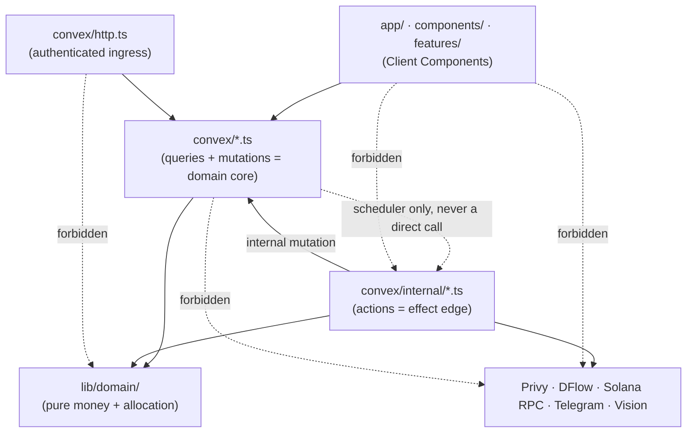
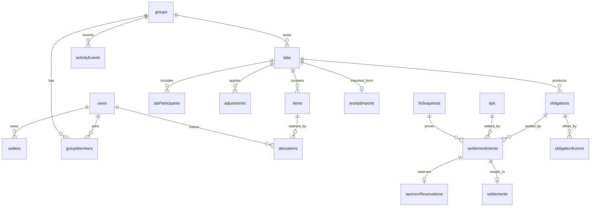
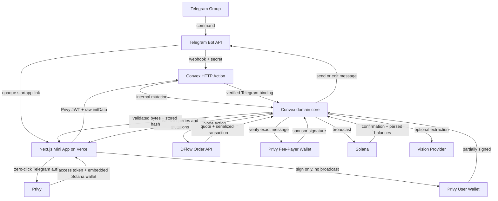

> ## ⚠ Amendment notice — read `docs/DECISIONS.md` first
>
> **This spine remains the binding technical and security substrate.** AD-1…AD-24 hold except
> as refined below; reasoning in **`docs/DECISIONS.md`**:
>
> - **AD-10** — address lookup tables are rejected outright on the **direct** path only. On the
>   routed path they are resolved at the response `contextSlot` and the expanded account set
>   faces identical rules, because every DFlow `/order` response carries exactly two tables and
>   a sweep of `maxAccounts` 24–64 found no lookup-free configuration. The gate was tightened,
>   never relaxed (**D-02**).
> - **AD-20** — Astryx is a **theme layer**; the UI primitives are ours. The prohibition on a
>   second component system still binds (**D-20**).
> - **AD-22** — the cluster is **mainnet-beta**, read from `lib/solana/cluster.ts`; DFlow serves
>   mainnet only (**D-01**).
> - Sponsored-transaction, durable-intent, ledger and state-machine decisions (AD-8, AD-9,
>   AD-11, AD-13, AD-17, AD-21, AD-24) are unamended, and are the reason nine live
>   authorization holes were findable at all (**D-18**).


# Architecture Spine — My Tab

## Design Paradigm

**Reactive document-store core with durable-intent orchestration at the edges.**

Convex is the domain core: a document-relational store whose transactional mutations *are* the domain layer and whose reactive queries *are* the read model. Every non-deterministic effect — DFlow, Privy, Solana RPC, Telegram, vision extraction — is pushed to the edge as a Convex action, and is never invoked as the first step of a money flow. Instead, a mutation writes a durable intent, then schedules the action; the action writes back through an internal mutation; the subscribed client sees the transition. Next.js is a thin reactive shell, not a second backend.

| Layer | Home | Owns |
| --- | --- | --- |
| Shell | `app/`, `components/`, `features/` | Rendering, provider composition, Telegram runtime, client orchestration |
| Authenticated ingress | `convex/http.ts` | Telegram/provider signature verification, launch-data verification, normalization, delegation to internal functions |
| Domain core | `convex/*.ts` (queries, mutations) | Product truth, authorization, transactional invariants |
| Effect edge | `convex/internal/*.ts` (actions) | External APIs, signing, broadcasting, extraction |
| Pure logic | `lib/domain/` | Money, allocation, remainder distribution — no I/O, unit-testable |

## Invariants & Rules

### AD-1 — Convex owns product truth [ADOPTED]

- **Binds:** all
- **Prevents:** a parallel REST backend growing inside Next.js Route Handlers, and product state splitting across two stores.
- **Rule:** Bills, items, claims, obligations, balances, settlement intents, tips, activity, and confirmation status live only in Convex. Convex HTTP Actions are the public provider-ingress adapters: they verify a signature, secret, or bearer identity, normalize, invoke only internal functions, and return. Next.js Route Handlers are limited to health and the AD-5 fallback token bridge; they never invoke privileged Convex writes. No bill calculation, authorization, DFlow orchestration, or ledger write may live in a Route Handler or HTTP Action.

### AD-2 — One repository, one backend, no second database [ADOPTED]

- **Binds:** all
- **Prevents:** re-introducing the discarded Supabase / Drizzle / Fastify plan, or a service monorepo the 10-day window cannot afford.
- **Rule:** A single Next.js repository with a colocated `convex/` directory. Do not add PostgreSQL, Supabase, Prisma, Drizzle, Redis, a separate Express/Fastify API, a duplicate websocket layer, a second state-management backend, or a Vercel Cron job that duplicates Convex scheduling.

### AD-3 — Two deployment targets, one build command [ADOPTED]

- **Binds:** NFR-8, deployment DoD
- **Prevents:** "deployed on Vercel" being mistaken for a single-provider backend, and Vercel drifting onto the wrong Convex deployment.
- **Rule:** Vercel deploys the Next.js app plus health and the optional AD-5 fallback token bridge. Convex Cloud deploys the database, HTTP ingress, functions, storage, scheduler, and realtime service. Vercel's build command is `npx convex deploy --cmd 'npm run build'` with `CONVEX_DEPLOY_KEY` in Vercel. Preview deployments use a separate Convex deployment, bot, RPC credentials, and sponsor wallet; provider egress and sponsor signing are fail-closed unless the environment is explicitly `production`.

### AD-4 — Privy DID is the canonical auth subject; Telegram is a linked identity

- **Binds:** FR-A1, FR-A2, FR-A4, FR-A5
- **Prevents:** two competing session systems, and a Solana address or Telegram ID becoming a primary key.
- **Rule:** Three identifiers stay distinct and are never collapsed: `privyDid` (from a verified Privy access token) is the authentication identity; `telegramUserId` (from server-verified Mini App `initData`) authorizes chat and group context; `walletAddress` / `privyWalletId` (from Privy) authorize signing. The Convex `users` document links them only after **both** Privy and Telegram verification succeed. Never run a separate Telegram-only application session beside Privy.

### AD-5 — Convex authenticates via Privy custom JWT, with a bounded fallback

- **Binds:** FR-A3
- **Prevents:** the Day 0 auth seam degrading into unauthenticated public mutations that take a user ID as an argument.
- **Rule:** Primary path — `ConvexProviderWithAuth` supplies `getAccessToken()`; `convex/auth.config.ts` declares `type: 'customJwt'`, `issuer: 'privy.io'`, `applicationID: <Privy app ID>`, `algorithm: 'ES256'`, and a `jwks` value. Prefer a **base64 `data:` URI JWKS** carrying the Privy app verification key over a hosted route (Convex supports data URIs; Privy publishes no JWKS endpoint — research R-2, R-3). Fallback, only if the Day 0 spike fails — a Vercel Route Handler verifies the Privy token with `@privy-io/node`, mints a five-minute My Tab JWT, and exposes its public key at `/.well-known/jwks.json`. Falling back to client-supplied user IDs is forbidden.

### AD-6 — Money is integer-only, end to end

- **Binds:** FR-M1, FR-M2, FR-M3, FR-M5
- **Prevents:** floating-point drift making a locked total irreconcilable.
- **Rule:** Fiat is a signed 64-bit integer in minor units (THB stores satang). Crypto is an atomic-unit integer carried as `bigint` or a decimal string across JSON boundaries. Mint decimals are persisted with every quote and settlement. JavaScript floating point never touches a persisted obligation, token amount, fee, or FX calculation. All allocation arithmetic lives in `lib/domain/` as pure functions with unit tests.

### AD-7 — Revision is the concurrency and freshness key

- **Binds:** FR-B4, FR-B6, FR-B7, FR-C3, FR-S2
- **Prevents:** a stale client editing a newer bill, and a quote outliving the bill it priced.
- **Rule:** Every draft edit increments `tabs.revision`. Claim and edit mutations reject a stale revision. Lock verifies all items are resolved and creates the immutable snapshot plus obligations **in one transaction**. Reopen is also one transaction: it first rejects while any old-revision intent is `user_signed`, `submitted`, or `unknown`; appends `obligationSuperseded` events for every previously active obligation; transitions only `created`, `quoting`, and `ready_for_signature` old-revision intents to `superseded`; then increments the revision. A later lock creates new immutable obligations; old obligations are never edited or counted in balances. A user-signed or possibly submitted transaction may not be silently invalidated.

### AD-8 — Durable intent before external effect

- **Binds:** NFR-1, NFR-2, FR-S1, FR-S2
- **Prevents:** money state that exists only inside an in-flight HTTP call.
- **Rule:** The browser never calls a public action as the first step of a money flow. The sequence is fixed: client mutation → validate and insert durable intent → `scheduler.runAfter(0, internalAction)` → external API call → internal mutation stores the result → subscribed client receives the update. Idempotency keys and their results persist in Convex, never in function-instance memory. A transactional partial-unique guard permits at most one nonterminal settlement intent per `(kind, obligationId|tipId)`; creating another returns the existing intent. Only `confirmed`, `failed`, `expired`, or `superseded` releases that guard, and `failed`/`expired` have the proof requirements in AD-11 and AD-21.

### AD-9 — One sponsorship path: user signs, server verifies, sponsor co-signs, server broadcasts

- **Binds:** FR-S3, FR-S4, FR-S7, FR-S8, NFR-4
- **Prevents:** three sponsorship mechanisms coexisting, and sponsor funds being exposed without a server verification gate.
- **Rule:** One dedicated Privy-managed Solana wallet is fee payer for every sponsored transaction, in both settlement modes. Convex builds or requests the transaction with that address as fee payer, validates it, stores its message hash; the user's Privy wallet signs **without broadcasting**; Convex re-parses the partially signed bytes and rejects any message change; Privy's server SDK adds the fee-payer signature; Convex broadcasts through the configured RPC. Client-side `signAndSendTransaction({sponsor: true})` and a raw-keypair sponsor are contingencies only — never shipped alongside this path in the judged build.

### AD-10 — Transaction validation is a versioned fail-closed manifest, run twice

- **Binds:** FR-S5, FR-S6
- **Prevents:** a client or an external router substituting a different transaction between quote and sponsorship.
- **Rule:** `convex/internal/solanaPolicy.ts` owns an immutable, versioned manifest of exact mainnet program IDs, permitted instruction discriminators, permitted mint accounts, and writable-account roles; deployment fails if the manifest is empty or contains a wildcard. Before returning bytes to the client **and** again immediately before sponsor co-signing, fully resolve legacy or v0 messages and verify every manifest predicate: authenticated payer owns the intent · payer wallet matches Privy · locked revision and unsuperseded target match · server-owned recipient and amount match · input/output mints match intent and allowlist · maximum input has not increased · minimum output meets the obligation · for a routed payment, the DFlow request used `allowSyncExec=true`, `allowAsyncExec=false`, `sponsorExec=false`, and `includeAddressLookupTables=true`, `otherAmountThreshold` meets the obligation, response `executionMode` is exactly `sync`, and `destinationWalletMustSign` is false · required signer set is exactly `{payerWalletAddress, sponsorWalletAddress}` · fee payer is the sponsor · platform fee is zero and `feeAccount` is absent · every program/instruction/writable role is manifest-allowed · no writable account is outside the role-derived set · compute-unit limit is at most 1,400,000 · priority fee is at most 250,000 lamports · at most one recipient ATA may be created and its rent debit is at most 2,500,000 lamports · total sponsor exposure is at most 3,000,000 lamports · recent blockhash and `lastValidBlockHeight` remain valid · serialized message hash matches. For a v0 message, fetch every referenced address-lookup table from the configured RPC at or after `contextSlot`, reject deactivated or mutable/mismatched entries, and compare the fully resolved account list to DFlow's included entries. No unresolved account may be signed.

### AD-11 — Confirmation, not submission, moves the ledger

- **Binds:** FR-L3, FR-S9, FR-M8
- **Prevents:** a broadcast signature being mistaken for settlement.
- **Rule:** A returned signature proves broadcast only. `confirmed` means Solana `finalized`, not merely processed/confirmed. Before any ledger change, fetch the finalized transaction and confirm: transaction succeeded · exact message hash matches · the correct recipient token account and mint changed · recipient increase meets target · payer debit stays within maximum input · platform fee is zero and `feeAccount` absent · sponsor debit stays within the owned reserved cap · signature and target have not been applied before. Then atomically consume the sponsor reservation, append one settlement-offset event, mark the intent confirmed, update derived balances, emit activity, and queue Telegram. A broadcast whose status cannot be observed becomes `unknown`, never `failed` or `expired`; it remains reserved and non-retriable. It may become `confirmed` at any later poll. Replacement is permitted only after the blockhash is invalid at `finalized` and two checks on distinct finalized slots find neither signature status (`searchTransactionHistory=true`) nor transaction; reconciliation continues for 24 hours. Any late or duplicate confirmation after replacement freezes the target and sponsor path, records a reconciliation incident, and never silently applies a second offset.

### AD-12 — Obligations are immutable ledger events

- **Binds:** FR-M8, FR-L4, FR-L5
- **Prevents:** a mutable `paid` flag destroying the audit trail and making balances unreconstructable.
- **Rule:** An obligation is never overwritten to mark it paid, waived, or superseded. A settlement event offsets it; waiver, manual-cash, and reopen each append a typed counter-event with actor, reason, source revision, and authorization evidence. Activity events are append-only. Balance queries fold only active obligations and their offset/counter-events, and every derived balance links to its source bill and revision.

### AD-13 — Recipient and amount come from the server, never the request

- **Binds:** FR-A5, FR-T5, FR-T6, FR-S6, security boundaries
- **Prevents:** payment redirection through a tampered client payload.
- **Rule:** Wallet addresses come from the Privy-synced Convex `wallets` record. Recipient addresses come from server-side obligation or tip records. Public tab tokens are opaque, hashed at rest, expirable, and revocable. Deep links carry only an opaque token — never a database ID, chat ID, Telegram ID, address, amount, or recipient. Convex public functions enforce authorization through the shared helpers (`requireIdentity`, `getCurrentUser`, `requireGroupMember`, `requireBillOrganizer`, `requireParticipant`, `requireIntentOwner`); the UI never does.

### AD-14 — Telegram ingress is one authenticated Convex HTTP boundary

- **Binds:** FR-N2, FR-N5
- **Prevents:** two live webhook endpoints double-processing updates.
- **Rule:** `POST https://<deployment>.convex.site/telegram/webhook` in `convex/http.ts` is the only Telegram Bot API webhook. It constant-time verifies `X-Telegram-Bot-Api-Secret-Token`, validates the payload schema and size, admits only supported update types, and calls an internal mutation that deduplicates by `(botId, update_id)` before any state change. It returns immediately after durable acceptance; scheduled internal actions own replies and all slow work. `POST /telegram/bootstrap` at the same Convex origin requires a valid Privy bearer JWT **and** raw Telegram `initData`; it verifies the Telegram HMAC with the bot token, rejects `auth_date` older than five minutes or more than 30 seconds in the future, matches `start_param` to the hashed tab token, and atomically creates or refreshes a five-minute server-side context bound to the verified Privy DID, Telegram user, chat, group, and session. Reload by the same DID with the same valid `initData` hash is idempotent; reuse of that hash by a different DID is rejected, audited, and writes no binding. CORS is exact-origin allowlisted. No Vercel process invokes a privileged Convex mutation and no client can call these internal mutations directly.

  The bot must be an administrator in every bound group. Bootstrap and every organizer/claim/payment authorization call `getChatMember(chatId, telegramUserId)` when the cached membership is older than five minutes; only `creator`, `administrator`, `member`, and a `restricted` member with membership still active are admitted. `chat_member` updates maintain membership and role changes, `my_chat_member` disables a group when the bot loses administrator status, and scheduled daily reconciliation refreshes active participants. A leave/ban revokes group authorization immediately. Signed `chat_instance` is stored as launch evidence but never substitutes for `getChatMember`.

### AD-15 — Client Components for live surfaces; no authenticated SSR

- **Binds:** FR-C3, FR-L2, rendering DoD
- **Prevents:** hydration and auth-refresh complexity spent on a hackathon shell.
- **Rule:** The active tab, claim board, balances, and settlement progress are Client Components — Convex reactivity requires a client connection. Server Components are for static shell and landing content only. Provider order is fixed: `TelegramRuntimeProvider` → `PrivyProvider` → `PrivyConvexProvider` (wrapping `ConvexProviderWithAuth`) → theme. Do not use TanStack Query for Convex data; Convex owns subscriptions, cache invalidation, and optimistic updates.

### AD-16 — Convex scheduler is the only job runner

- **Binds:** NFR-6, FR-B6
- **Prevents:** a second scheduling system with its own failure modes and env surface.
- **Rule:** Quote expiration, confirmation polling, failed-action retry, payment reminders, inactive `draft|open` tab archival, abandoned-upload cleanup, and demo-data reset all run on the Convex scheduler and crons. A locked or settling bill with unresolved obligations never expires or archives; its obligations and reconciliation remain active until explicitly settled or offset. No Vercel Cron in P0.

### AD-17 — Sponsorship exposure is capped and killable

- **Binds:** NFR-4
- **Prevents:** ATA create/close cycling or quote spam draining the fee-payer wallet.
- **Rule:** `sponsor-v1` is config-versioned and integer-lamport only. Its canonical caps are: per transaction 3,000,000 production/development; per user per UTC day 15,000,000 production and 6,000,000 development; per payer wallet per UTC day 15,000,000 and 6,000,000; per group per UTC day 75,000,000 and 20,000,000; daily aggregate 250,000,000 and 50,000,000; global epoch until operator reset 1,000,000,000 and 100,000,000. At most one recipient ATA and 250,000 priority-fee lamports are allowed per intent. The production sponsor wallet holds at most 1 SOL; development holds at most 0.25 SOL. Lower overrides are allowed; any increase requires a reviewed config change and policy-version bump. In the same mutation that moves an intent to `ready_for_signature`, atomically reserve its worst-case sponsor debit against all six dimensions. `unknown` keeps the reservation; pre-broadcast `failed`, `expired`, or `superseded` releases it; finalized confirmation settles actual debit and releases the remainder. The co-sign action rechecks the global kill switch, environment, policy version, reservation ownership, all counters, and AD-10 manifest immediately before requesting the Privy signature. Pause blocks creation, reservation, co-sign, and broadcast while leaving all reads and confirmation/reconciliation polling active.

### AD-18 — Receipt extraction is advisory input, never authority

- **Binds:** FR-R3, FR-R4, FR-R5
- **Prevents:** a model output becoming an obligation.
- **Rule:** Extraction runs through the repository's `receiptExtraction` adapter in a Convex Node action against the OpenAI Responses API with image input and a strict output schema. `OPENAI_API_KEY` exists only in Convex; the vision-capable model ID is pinned in deployment configuration after the Thai/English receipt fixture evaluation, and a provider/model change requires an architecture decision plus fixture rerun. Every amount is re-parsed to integer minor units and every line total recalculated deterministically before display. Organizer confirmation is required before bill items are created. No model may assign participants, resolve disputes, produce final totals, or sign or submit a transaction.

### AD-19 — Secret placement follows the consuming runtime

- **Binds:** NFR-7, NFR-8
- **Prevents:** a server secret reaching the client bundle, or the same secret drifting across two runtimes.
- **Rule:** No server secret carries a `NEXT_PUBLIC_` prefix. Convex holds: DFlow API key, Telegram bot token **and webhook secret**, `OPENAI_API_KEY` for receipt extraction, Privy app secret and sponsor wallet ID, server RPC key, provider-webhook secrets, and FX policy. Vercel holds only `CONVEX_DEPLOY_KEY` and, if AD-5 fallback activates, Privy verification credentials plus the token-bridge signing key. Never duplicate a secret across both without a concrete runtime need. Never log access tokens, raw `initData`, signed transactions, receipt bytes, or bot tokens.

### AD-20 — Astryx is the only component system

- **Binds:** FR sections 9–10 of the PRD, design DoD
- **Prevents:** two design systems fighting over tokens and bundle size.
- **Rule:** `@astryxdesign/core` extending `@astryxdesign/theme-neutral`, forced `mode="light"` for the judged build. Astryx supplies controls, cards, forms, sheets, avatars, progress, badges, skeletons, and empty states. Custom components exist only for receipt rows, item claiming, split allocation, tip composition, and settlement progress. Do not combine with shadcn/ui or another full system. Do not add `@stylexjs/babel-plugin` to the App Router app — it disables SWC and breaks `next/font` (research R-5).

### AD-21 — One persisted settlement state machine

- **Binds:** FR-S1..S10, NFR-1, NFR-2
- **Prevents:** UI labels becoming database states and ambiguous retry paths producing duplicate payment.
- **Rule:** `settlementIntents.status` is exactly `created | quoting | ready_for_signature | user_signed | submitted | unknown | confirmed | failed | expired | superseded`. Allowed transitions are `created→quoting`; `quoting→ready_for_signature|failed|expired|superseded`; `ready_for_signature→user_signed|expired|superseded`; `user_signed→submitted|failed`; `submitted→unknown|confirmed|failed`; `unknown→confirmed|failed`; terminal states have no outgoing transition. `user_signed` never expires or becomes superseded and blocks reopen while sponsor work may run; its `failed` transition requires a proven pre-broadcast rejection with no sponsor signature or broadcast possibility. `failed` after broadcast requires an observed finalized chain error; `expired` is limited to `created|quoting|ready_for_signature`; `superseded` is limited to safely invalidated `created|quoting|ready_for_signature` old-revision intents. `awaiting_wallet`, `presigned`, `confirming`, and product copy such as “Ready to settle” are derived UI labels, never persisted states.

### AD-22 — FX snapshots are immutable rational inputs

- **Binds:** FR-M6, FR-S1, FR-T2, FR-T3
- **Prevents:** THB obligations or tips changing value between quote, approval, and settlement, and floating-point or inverted-rate errors.
- **Rule:** P0 settlement uses THB as fiat base, USD as reference, and USDC as the exact output mint at 1 USDC = 1 USD for product accounting. The production source is Frankfurter v2 `USD/THB` filtered to the Bank of Thailand provider; a Convex action normalizes the decimal response into a reduced integer rational snapshot `{baseCurrency:'THB', quoteMint:USDC_MINT, numeratorAtomic, denominatorMinor, provider:'frankfurter:BOT', providerAsOf, fetchedAt, expiresAt}` such that `usdcAtomic = ceil(thbMinor × numeratorAtomic / denominatorMinor)`. Never parse the provider value through a JavaScript number. Snapshots are usable through 36 hours from provider date on weekdays and 96 hours across weekends/Thai bank holidays; beyond that, new settlement/tip intents fail closed with rate-unavailable copy. A development/demo-only manual rational is allowed only when `ENVIRONMENT!='production'` and is visibly labeled. The snapshot ID and rational are copied onto every intent and never refreshed after user approval; DFlow then solves the exact USDC output. Display conversions round half-away-from-zero, while amounts owed round upward so the recipient is never short.

### AD-23 — Receipt bytes are private and expire on a fixed schedule

- **Binds:** FR-R1..R7, NFR-7
- **Prevents:** permanent bearer URLs leaking receipt images and indefinite retention of sensitive purchase data.
- **Rule:** Original receipt bytes live in Convex storage but `storage.getUrl()` is never returned to a client. An authenticated `GET /receipts/blob` Convex HTTP Action accepts the Privy bearer JWT, checks organizer/participant access through an internal query, streams at most 10 MB with `Cache-Control: private, no-store`, and records access; the browser creates only an in-memory object URL. Original image and provider payload are deleted at the earlier of 30 days after upload or 7 days after tab completion; failed/abandoned uploads are deleted after 24 hours. Normalized, organizer-confirmed line items remain with the bill for 365 days; then a cron deletes them while retaining a non-sensitive tombstone and audit IDs. User-requested deletion may shorten but never extend these periods.

### AD-24 — Resource-consuming operations reserve bounded budgets

- **Binds:** FR-N1, FR-N4, FR-R1..R7, NFR-2, NFR-6, NFR-11
- **Prevents:** valid but abusive requests exhausting Convex records/storage, Telegram throughput, DFlow/FX/vision-provider budgets, or service concurrency.
- **Rule:** Convex owns one atomic quota-reservation primitive keyed by operation, verified actor, group, time window, and global epoch. Tab creation allows 10 per user per UTC day, 30 per group per UTC day, 10,000 globally per UTC day, and at most 10 simultaneously open tabs per group. Receipt upload atomically creates a `ticketed` import plus a one-use organizer-bound ticket expiring after 10 minutes; tickets never renew. `ticketed|uploaded|extracting|needs_review` count toward the limit of 3 active imports per user and 10 per group. Finalization binds exactly one storage ID, validates JPEG/PNG/WebP magic type, ≤10 MB, ≤10,000 pixels per edge and ≤25 decoded megapixels, and moves to `uploaded`; HEIC must be converted client-side. A cron deletes expired unused tickets, any unbound/orphan storage object, and its active-capacity reservation. Invalid or mismatched blobs move to `rejected` and delete immediately. Extraction reserves before scheduling, permits 10 calls per user per UTC day, 30 per group per UTC day, 1,000 globally per UTC day, 2 concurrent per group, and 50 concurrent globally. Extraction has a 90-second deadline; its concurrency lease expires after two minutes without a 30-second heartbeat and is released on success, schema rejection, provider failure, timeout, cancellation, or crash recovery. `confirmed|failed|rejected|deleted` do not count active. Consumed daily/hourly operations remain charged for their window; only unused reserved attempts and concurrency/active-capacity leases release. DFlow/FX/vision provider calls additionally use 30 attempts per user per hour, 100 per group per hour, and 10,000 globally per hour. A DFlow solve atomically reserves four hourly attempt tokens before its first request, settles actual calls and releases unused tokens, retains its three-second bound, and releases its concurrency lease on every terminal/crash path. Telegram command effects reserve before writing state or sending a message; update-ID idempotency remains separate. A reviewed operational pause can stop new tab creation, receipt extraction, or provider quoting without disabling reads, existing-tab manual entry, or recovery. Limits are deployment configuration that may be lowered operationally; raising them requires security review. Every boundary has `limit-1`, `limit`, `limit+1`, concurrency-race, ticket-abandonment, orphan cleanup, crash/timeout recovery, reservation settlement/release, and pause tests. Client IP may be a secondary signal only at unauthenticated HTTP edges and is never trusted as identity or taken from an untrusted forwarding header.

### Dependency direction



Read the dotted forbidden edges as rules: the shell never calls an action directly or an external service directly; HTTP actions never contain domain logic or call public write functions; a mutation never performs I/O.

## Consistency Conventions

| Concern | Convention |
| --- | --- |
| Naming — Convex tables | camelCase plural: `users`, `wallets`, `groups`, `groupMembers`, `tabs`, `tabParticipants`, `items`, `allocations`, `adjustments`, `obligations`, `obligationEvents`, `tips`, `settlementIntents`, `settlements`, `sponsorReservations`, `sponsorUsageBuckets`, `fxSnapshots`, `activityEvents`, `receiptImports`, `receiptAccessEvents` |
| Naming — Convex functions | `<module>.<verb><Noun>` — `tabs.getByPublicToken`, `allocations.claim`, `settlements.createIntent`. Internal functions live under `convex/internal/` and are never exported publicly |
| Naming — indexes | `by_<field>` / `by_<field>_and_<field>`, matching Convex convention: `by_privy_did`, `by_group_and_user`, `by_idempotency_key` |
| Naming — money fields | Every integer money field ends in `Minor` (fiat) or `Atomic` (crypto). A field without that suffix is not money |
| Data — ids | Convex document IDs for every internal relationship. `privyDid` only as the external auth subject. Never a Solana address as a key |
| Data — timestamps | Integer milliseconds. Fields: `createdAt`, `updatedAt`, `lockedAt`, `completedAt`, `expiresAt`, `confirmedAt` |
| Data — money types | `v.int64()` for fiat minor units; decimal strings at boundaries where an external SDK requires them |
| Data — validation | Convex validators at every public function boundary; Zod only where Convex validators cannot cover external payload shapes (DFlow responses, vision output, Telegram updates) |
| State — mutation | AD-21 is the only persisted settlement enum and transition table. Terminal states (`confirmed`, `failed`, `expired`, `superseded`) never transition back |
| State — auth | Every public query and mutation begins with the shared authorization helper for its scope. No ad-hoc auth logic |
| State — logging | Structured identifiers only: `tabId`, `intentId`, `userId`, `transactionSignature`, `dflowContextSlot`, `policyVersion`, `statusTransition`, `durationMs`, `failureCode`. Never secrets, tokens, or transaction bytes |
| State — Node runtime | `"use node"` appears only in action files that genuinely need Node packages; keep simple fetch actions in the default runtime to avoid cold starts |
| Errors | Failure codes are stable string enums persisted on the settlement record and mapped to product copy in the shell — never raw provider errors surfaced to users |

## Stack

Verified current at authoring (2026-08-21). The code owns this once it exists.

| Name | Version |
| --- | --- |
| Next.js | current stable, App Router |
| React / React DOM | 19.x (hard peer-dep floor for Astryx) |
| TypeScript | 5.x, strict mode |
| Convex | current stable (`convex/react`, `convex/server`) |
| `@privy-io/react-auth` | current stable, Solana enabled |
| `@privy-io/node` (server SDK) | current stable — sponsor co-sign, token verification |
| `@astryxdesign/core` + `@astryxdesign/theme-neutral` + `@stylexjs/stylex` | current Beta |
| `@solana/kit` | current stable — transaction parse and construct |
| `@tma.js/sdk-react` or a narrow Telegram adapter | current stable, client-only |
| Zod | current stable, boundary validation only |
| Solana | mainnet, private RPC |
| DFlow Order API | current |

## Structural Seed

```text
my-tab/
  app/
    (miniapp)/
      page.tsx                     # Tabs
      tabs/[publicToken]/page.tsx  # Claim board / bill room
      activity/page.tsx
      you/page.tsx
    api/
      auth/convex-token/route.ts   # AD-5 fallback only
      .well-known/jwks.json/route.ts  # AD-5 fallback only
      health/route.ts
    layout.tsx
    providers.tsx                  # AD-15 fixed provider order
  components/
    primitives/                    # Astryx wrappers
    tab-card/ claim-row/ balance-banner/ settlement-sheet/ settlement-receipt/
  features/
    telegram/ auth/ tabs/ bills/ claims/ balances/ tips/ settlement/ receipts/
  lib/
    domain/                        # AD-6 pure money + allocation, unit-tested
    telegram/ privy/ solana/ dflow/ formatting/
  convex/
    schema.ts  auth.config.ts  http.ts       # AD-14 Telegram/bootstrap + AD-23 receipt ingress
    users.ts groups.ts tabs.ts items.ts allocations.ts adjustments.ts
    obligations.ts tips.ts settlements.ts activity.ts receipts.ts crons.ts
    sponsorPolicy.ts fxSnapshots.ts
    internal/                      # AD-8 effect edge
      telegram.ts dflow.ts solana.ts solanaPolicy.ts privy.ts confirmations.ts
      fx.ts receiptExtraction.ts receiptRetention.ts
  tests/
    domain/ convex/ e2e/
  convex.json  next.config.ts  vercel.json  package.json
```

### Core entities



### Runtime topology



### Settlement sequence

```mermaid
sequenceDiagram
  participant UI as Mini App
  participant CX as Convex
  participant DF as DFlow
  participant UW as Privy User Wallet
  participant SW as Privy Fee-Payer Wallet
  participant SOL as Solana

  UI->>CX: settlements.createIntent(obligationId, inputMint)
  CX->>CX: insert intent status=created
  CX->>DF: sponsored order (sync=true, async=false, sponsorExec=false, includeALTs=true)
  DF-->>CX: sync quote + serialized transaction + ALT entries
  CX->>CX: resolve v0/ALTs, AD-10 validate, reserve sponsor budget
  CX->>CX: store hash, status=ready_for_signature
  CX-->>UI: quote summary + transaction bytes
  UI->>UW: signTransaction (no broadcast)
  UW-->>UI: partially signed transaction
  UI->>CX: submitUserSignedTransaction(intentId, bytes)
  CX->>CX: AD-10 re-parse, recheck pause/reservation, verify exact message
  CX->>SW: signTransaction(sponsorWalletId, bytes)
  SW-->>CX: sponsor-signed transaction
  CX->>SOL: broadcast
  SOL-->>CX: signature; poll submitted/unknown until finalized
  CX->>CX: AD-11 settle once, consume reservation, emit activity, queue Telegram
```

## Capability → Architecture Map

| Capability / Area | Lives in | Governed by |
| --- | --- | --- |
| FR-A auth and identity | `app/providers.tsx`, `convex/auth.config.ts`, `convex/http.ts`, `convex/users.ts` | AD-4, AD-5, AD-13, AD-14, AD-15 |
| FR-W wallets | `convex/users.ts`, `convex/internal/privy.ts` | AD-4, AD-13, AD-19 |
| FR-G groups | `convex/groups.ts`, `convex/internal/telegram.ts` | AD-1, AD-13, AD-14 |
| FR-B bills · FR-C claims | `convex/tabs.ts`, `convex/items.ts`, `convex/allocations.ts`, `features/claims/` | AD-1, AD-7, AD-15 |
| FR-M calculation and ledger | `lib/domain/`, `convex/tabs.ts` (lock), `convex/obligations.ts`, `convex/internal/fx.ts` | AD-6, AD-7, AD-12, AD-22 |
| FR-L balances and activity | `convex/obligations.ts`, `convex/activity.ts` | AD-11, AD-12 |
| FR-T tips | `convex/tips.ts`, `features/tips/` | AD-8, AD-13 |
| FR-S settlement | `convex/settlements.ts`, `convex/internal/{dflow,solana,solanaPolicy,privy,confirmations}.ts` | AD-8, AD-9, AD-10, AD-11, AD-17, AD-21, AD-22 |
| FR-R receipts | `convex/http.ts`, `convex/receipts.ts`, `convex/internal/{receiptExtraction,receiptRetention}.ts` | AD-18, AD-23 |
| FR-N Telegram | `convex/http.ts`, `convex/internal/telegram.ts` | AD-14, AD-16 |
| NFR-4/17 sponsorship safety | `convex/internal/privy.ts`, sponsor policy module | AD-9, AD-17, AD-19 |
| Design system | `components/primitives/`, theme provider | AD-20 |

## Day 0 Gate

Full-stack UI work does not begin until all five pass in a **deployed** Telegram Mini App:

1. Next.js App Router loads inside Telegram from Vercel.
2. Privy performs seamless Telegram authentication and creates a Solana embedded wallet.
3. A Privy access token authenticates a Convex query through the selected JWT path — inspect the real token header for `kid`, `alg`, `aud`, `iss`, and refresh behavior (see OQ-1 / research R-1). If this fails, implement the AD-5 fallback immediately.
4. The bot is administrator in a test supergroup; raw Telegram `initData` verifies in the Convex bootstrap HTTP Action, `getChatMember` authorizes the user, and leave/rejoin updates change access.
5. One direct exact-USDC transaction: Convex builds the transfer without DFlow; the user signs through Privy without broadcasting; Convex validates the full manifest and `sponsor-v1` reservation; the Privy fee-payer wallet co-signs; Convex broadcasts and applies the recipient balance change only at finalized commitment.

Before Epic 6 routing begins, a separate deployed DFlow gate must prove native SOL → exact USDC with `executionMode='sync'`, `destinationWalletMustSign=false`, complete ALT resolution, both AD-10 validation passes, sponsor co-sign, broadcast, and finalized semantic confirmation. This routing gate does not delay the direct-USDC Day 0 proof or remove the routed-payment scope.

## Deferred

These are sequencing boundaries, not scope cuts: the full PRD and 70-story backlog remain committed. Each item starts only after the invariant it depends on has passed its gate.

- **External Solana wallets (P1).** The embedded-wallet path must work first; wallet-standard connection changes no invariant here.
- **Allocation modes beyond equal split.** Quantity, percentage, and fixed modes fit the existing `allocations` shape; deferring them costs no rework.
- **Debt compression.** Pure `lib/domain/` addition over confirmed net positions — no schema or settlement change.
- **Cross-group netting.** Explicitly out of scope; would change the balance derivation model and is not decided here.
- **Privy Swap API as the routing layer.** Contingency only (OQ-5); adopting it would retire AD-9's DFlow order construction and needs an explicit decision.
- **Per-story test strategy.** Owned by the test-design pass, not this altitude. This spine fixes only that `lib/domain/` is pure and unit-tested and that Convex integration tests cover auth, concurrency, and idempotency.
- **Multi-currency recipient preferences.** P0 is USDC-only; the `settlementIntents` shape already carries `outputMint` for later.
