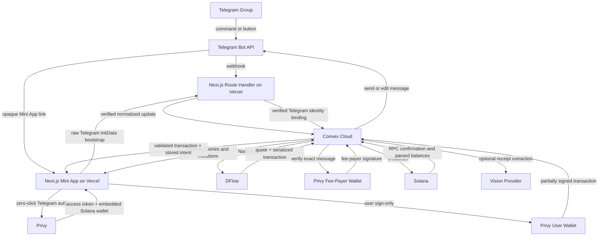

# My Tab Architecture Specification

**Version:** 1.3<br>
**Date:** August 21, 2026<br>
**Product:** My Tab<br>
**Primary stack:** Next.js, Convex, Privy, Vercel<br>
**External infrastructure:** Telegram Bot API, Solana RPC, DFlow

---

## 0. Binding Errata — August 21, 2026

This file is retained as the original long-form design discussion. The adjacent `ARCHITECTURE-SPINE.md` is the binding implementation contract. The replacements below are normative and override every conflicting example, diagram, schema, route, environment variable, status, and build-day instruction later in this source. No later section in this file may override them.

| Superseded source statement | Exact binding replacement |
|---|---|
| Sections 1, 3, 4, 6.5, 12, 13, and 14 place Telegram webhook/bootstrap in Vercel and let Vercel invoke Convex. | `convex/http.ts` owns the only Telegram webhook (`/telegram/webhook`) and launch bootstrap (`/telegram/bootstrap`). The webhook constant-time verifies `X-Telegram-Bot-Api-Secret-Token`; bootstrap requires a Privy bearer JWT and HMAC-valid raw `initData` no older than five minutes. Both invoke only internal Convex functions. Vercel owns only the UI, health route, deploy key, and the optional AD-5 token bridge; it performs no privileged Convex write. `TELEGRAM_BOT_TOKEN` and `TELEGRAM_WEBHOOK_SECRET` exist only in Convex. |
| Group membership is inferred from launch data or observed messages. | The bot must be group administrator. `getChatMember` is authoritative at bootstrap and whenever cached membership is older than five minutes. `chat_member` updates maintain joins/leaves/role changes, `my_chat_member` disables the group if bot-admin status is lost, and a daily reconciliation refreshes active participants. `chat_instance` is evidence, not membership authority. |
| Section 8 mutates `obligations.settledMinor/status`. | Obligations are immutable. `obligationEvents` appends `settlement_offset`, `waiver`, `manual_cash`, and `superseded` counter-events; balances fold only active obligations and their events. Reopen rejects while an old-revision intent is `submitted`/`unknown`, appends supersession events, supersedes all pre-broadcast old-revision intents, then increments revision atomically. |
| Sections 8 and 15 use the old settlement enum and `dflowOrderId`. | The only intent enum is `created | quoting | ready_for_signature | user_signed | submitted | unknown | confirmed | failed | expired | superseded`. Only `created|quoting|ready_for_signature` may expire or become superseded; `user_signed` blocks reopen and resolves only to submitted or proven pre-broadcast failed. `failed` after broadcast requires an observed finalized chain error. DFlow has no order ID; My Tab's idempotency key, message hash, blockhash, `lastValidBlockHeight`, and context slot own identity/freshness. At most one nonterminal intent exists per obligation or tip. |
| Sections 10 and 11 permit the DFlow defaults and describe generic transaction allowlists. | Every DFlow request sets `allowSyncExec=true`, `allowAsyncExec=false`, `sponsorExec=false`, and `includeAddressLookupTables=true`; any `executionMode!='sync'` or `destinationWalletMustSign=true` is rejected. `convex/internal/solanaPolicy.ts` owns a nonempty versioned manifest of exact program IDs, instruction discriminators, mint accounts, and writable roles. Legacy/v0 messages and all ALTs are resolved and checked twice; signer set is exactly payer+sponsor. Compute limit ≤1,400,000, priority fee ≤250,000 lamports, ≤1 new ATA with rent ≤2,500,000, total sponsor debit ≤3,000,000. |
| Sections 8, 11, and 15 allow a submitted transaction to become expired/retriable after polling timeout. | Broadcast moves to `submitted`; unobserved status moves to `unknown` and remains reserved/non-retriable. Ledger movement waits for a parsed `finalized` transaction. Replacement needs finalized blockhash invalidity plus two distinct-finalized-slot checks with no signature history or transaction. Old signatures are reconciled for 24 hours; a duplicate/late contradiction freezes settlement and sponsorship for investigation. |
| Section 10 lists qualitative sponsorship caps. | `sponsor-v1` atomically reserves on entering `ready_for_signature`: 3,000,000 lamports/intent; production/development user-day 15,000,000/6,000,000, wallet-day 15,000,000/6,000,000, group-day 75,000,000/20,000,000, daily aggregate 250,000,000/50,000,000, and global epoch 1,000,000,000/100,000,000 until operator reset. Production sponsor balance cap is 1 SOL; development is 0.25 SOL. `unknown` retains reservation; proven pre-broadcast terminal states release it; confirmation settles actual debit. The kill switch is rechecked immediately before co-sign and broadcast. |
| Sections 7–11 leave fiat conversion implicit. | Frankfurter v2 `USD/THB` filtered to the Bank of Thailand provider is the production FX source. Store an immutable reduced rational snapshot and compute `usdcAtomic = ceil(thbMinor × numeratorAtomic / denominatorMinor)` without JavaScript floating point. Treat USDC as USD 1.00 for product accounting. Freshness is 36 hours on weekdays and 96 hours across weekends/Thai bank holidays; fail closed beyond it. Manual rates are nonproduction only. |
| Sections 7, 8, 13, and 14 imply Convex file URLs can be short-lived receipt links. | Never expose `storage.getUrl()`. Authenticated Convex HTTP Action `/receipts/blob` checks participant/organizer access and streams ≤10 MB with `private, no-store`; the browser uses an in-memory object URL. Delete originals/provider payload at the earlier of 30 days after upload or 7 days after completion; abandoned uploads after 24 hours; normalized confirmed items after 365 days, retaining only non-sensitive tombstones/audit IDs. |
| Section 18 schedules Telegram UI before the live money seam. | The binding Day 0 gate in the spine precedes full-stack UI work: deployed Telegram/Privy/Convex auth, bot-admin membership lifecycle, exact sync-only DFlow transaction, v0/ALT and manifest validation, atomic sponsor reservation, two signatures, broadcast, and finalized parsed confirmation must all pass first. This changes order only; it removes no feature or story from scope. |

The full feature scope and all 70 stories remain planned. These errata change unsafe mechanics and sequencing, not product ambition.

## 1. Architecture Decision

My Tab will use one TypeScript repository with four clear platform responsibilities:

| Platform | Responsibility |
|---|---|
| **Next.js** | Telegram Mini App UI, App Router, providers, client orchestration, and the smallest possible set of public route handlers. |
| **Convex** | Realtime database, transactional domain logic, queries, mutations, external-service actions, scheduling, retries, and activity state. |
| **Privy** | Seamless Telegram authentication, embedded Solana wallets, user transaction approval, and the preferred native app-pays gas-sponsorship path. |
| **Vercel** | Production and preview deployment for the Next.js application plus thin Telegram, auth, and provider webhook Route Handlers. |

This replaces the earlier Supabase, Drizzle, Fastify, separate API service, and Phantom plan.

### Deployment correction

Vercel does **not** host the Convex backend. The production system has two deployment targets:

1. **Vercel:** Next.js application and thin HTTP routes.
2. **Convex Cloud:** database, realtime subscriptions, functions, scheduled jobs, and server actions.

Treat “deployed on Vercel” as the web deployment decision, not as a single-provider backend architecture.

---

## 2. Product Architecture Principles

1. **Convex owns product truth.** Bills, item claims, obligations, balances, settlement intents, and confirmation status live in Convex.
2. **Next.js stays thin.** Do not rebuild a parallel REST backend inside Route Handlers.
3. **Privy owns wallet UX.** Users should not need Phantom, a browser extension, a seed phrase, or SOL for network fees.
4. **Telegram and Privy identities remain distinct.** Privy authenticates the person and wallet; verified Telegram launch data authorizes group and chat context.
5. **Every money transition is deterministic.** A Convex mutation records intent before any external API action runs.
6. **External side effects run after durable state.** A mutation writes the intent and schedules an internal action for DFlow, Privy, Solana RPC, Telegram, or receipt extraction.
7. **Vercel Cron is unnecessary for P0.** Use the Convex scheduler for quote expiration, confirmation polling, reminders, and retry workflows.
8. **Use one sponsorship path in the judged build.** Use a dedicated Privy-managed Solana fee-payer wallet. The user signs without broadcasting, Convex verifies the exact stored transaction message, the Privy server wallet adds the fee-payer signature, and Convex broadcasts. Keep Privy client-side `sponsor: true` as an emergency contingency only, not a second active path.

---

## 3. System Topology



---

## 4. Repository Shape

Use a single repository. Convex removes the need for a separate API application or pnpm service monorepo.

```text
my-tab/
  app/
    (miniapp)/
      page.tsx
      tabs/[publicToken]/page.tsx
      activity/page.tsx
      you/page.tsx
    api/
      telegram/
        webhook/route.ts            # verified bot ingress; delegates to Convex
      privy/
        webhook/route.ts            # optional signed provider events
      auth/
        bootstrap/route.ts           # Telegram binding and optional auth bridge
        convex-token/route.ts        # fallback only
      .well-known/
        jwks.json/route.ts            # only if Convex needs an app-hosted JWKS
      health/route.ts
    layout.tsx
    providers.tsx

  components/
    primitives/                      # Astryx wrappers
    tab-card/
    claim-row/
    balance-banner/
    settlement-sheet/
    settlement-receipt/

  features/
    telegram/
    auth/
    tabs/
    bills/
    claims/
    balances/
    tips/
    settlement/
    receipts/

  lib/
    domain/                          # pure money and allocation logic
    telegram/
    privy/
    solana/
    dflow/
    formatting/

  convex/
    schema.ts
    auth.config.ts
    http.ts                          # optional provider HTTP actions only
    users.ts
    groups.ts
    tabs.ts
    items.ts
    allocations.ts
    adjustments.ts
    obligations.ts
    tips.ts
    settlements.ts
    activity.ts
    receipts.ts
    crons.ts
    internal/
      telegram.ts
      dflow.ts
      solana.ts
      privy.ts
      confirmations.ts
      receiptExtraction.ts

  public/
  tests/
    domain/
    convex/
    e2e/

  package.json
  next.config.ts
  convex.json
  vercel.json
```

### Do not add

- A separate Express or Fastify API.
- Supabase or PostgreSQL for the MVP.
- Drizzle ORM.
- A duplicate websocket layer.
- A second state-management backend.
- A Vercel Cron job that duplicates Convex scheduling.

---

## 5. Frontend Architecture

### Framework

- Next.js App Router.
- React 19.
- TypeScript strict mode.
- Astryx custom My Tab light theme.
- `@tma.js/sdk-react` or a narrow Telegram adapter loaded only in client components.
- Privy React SDK with Solana enabled.
- Convex React client for reactive queries.

### Rendering rule

The active tab, claim board, balances, and settlement progress must be Client Components because Convex reactivity depends on a client connection. Use Server Components for static shell content only. Do not invest in advanced authenticated SSR for the hackathon.

### Provider order

```tsx
<PrivyProvider appId={env.NEXT_PUBLIC_PRIVY_APP_ID} config={privyConfig}>
  <ConvexAuthProvider>
    <TelegramProvider>
      <Theme theme={myTabTheme} mode="light">
        {children}
      </Theme>
    </TelegramProvider>
  </ConvexAuthProvider>
</PrivyProvider>
```

The exact Convex auth wrapper depends on the Privy-to-Convex JWT spike described below.

---

## 6. Identity and Authentication

### 6.1 Canonical identities

My Tab needs three identifiers and must never collapse them into one unverified client field:

| Identifier | Source | Purpose |
|---|---|---|
| `privyDid` | Verified Privy access token | Canonical authenticated user identity. |
| `telegramUserId` | Verified Telegram Mini App `initData` | Telegram profile and group authorization. |
| `walletAddress` / `privyWalletId` | Privy | Solana ownership and transaction signing. |

The Convex `users` document links these identifiers after both Privy and Telegram verification succeed.

### 6.2 Privy Telegram login

Configure Telegram as a Privy login method and enable seamless Telegram Mini App authentication. When the Mini App opens inside Telegram, Privy should authenticate without presenting a second login screen and create a Solana embedded wallet for new users.

### 6.3 Telegram verification still remains mandatory

Privy authentication does not replace Telegram launch-data validation. My Tab still needs raw Telegram `initData` to authorize:

- Telegram user ID.
- Chat or group context.
- Start parameter.
- Bot-created tab session.
- Membership and organizer permissions.

Never trust `initDataUnsafe`, a browser-supplied Telegram ID, or a client-supplied chat ID.

### 6.4 Convex authentication bridge

Privy access tokens contain the fields Convex custom JWT authentication expects: `sub`, `iss`, `aud`, `iat`, and `exp`. The integration still needs a compatible JWKS endpoint.

**Primary path:**

1. `ConvexProviderWithAuth` obtains the current Privy access token using `getAccessToken()`.
2. `convex/auth.config.ts` accepts a custom JWT with:
   - issuer: `privy.io`
   - audience: the Privy app ID
   - algorithm: ES256
3. Vercel exposes the Privy app public verification key in JWKS format at `/.well-known/privy-jwks.json`.
4. Convex resolves `ctx.auth.getUserIdentity().subject` to the Privy DID.

**Required Day 0 test:** inspect the real Privy JWT header and confirm the `kid`, algorithm, audience, issuer, refresh behavior, and Convex acceptance.

**Fallback path:** if the Privy verification key cannot be exposed as a stable JWKS accepted by Convex, use a thin Vercel token bridge:

1. Verify the Privy access token with `@privy-io/node`.
2. Mint a five-minute My Tab JWT from a Vercel Route Handler.
3. Expose the My Tab public signing key through `/.well-known/jwks.json`.
4. Configure Convex custom JWT auth against that route.

Do not fall back to unauthenticated public Convex mutations with client-supplied user IDs.

### 6.5 Bootstrap flow

```text
Mini App opens
  -> Privy seamless Telegram login completes
  -> client obtains Privy access token
  -> client submits raw Telegram initData and start parameter
  -> server verifies both identities
  -> Convex upserts user, Telegram binding, wallet, and membership
  -> app subscribes to the requested tab
```

---

## 7. Convex Backend Design

### 7.1 Queries

Queries are reactive reads only.

- `tabs.getByPublicToken`
- `tabs.listMine`
- `tabs.getClaimBoard`
- `groups.getOverview`
- `groups.getBalance`
- `activity.listForGroup`
- `settlements.getIntent`
- `users.getMe`

Every user-scoped query checks `ctx.auth.getUserIdentity()` and membership.

### 7.2 Mutations

Mutations own deterministic state transitions and transactional invariants.

- `users.bindTelegramIdentity`
- `groups.resolveFromTelegramChat`
- `tabs.create`
- `tabs.join`
- `tabs.updateDraft`
- `items.create`
- `items.update`
- `items.remove`
- `allocations.claim`
- `allocations.unclaim`
- `allocations.splitEqually`
- `tabs.lock`
- `tabs.reopen`
- `tips.createIntent`
- `settlements.createIntent`
- `settlements.submitUserSignedTransaction`
- `settlements.recordManualSettlement`

All public mutations must:

- Validate arguments.
- Require authentication.
- Authorize group and tab access.
- Reject stale tab revisions.
- Use integer money units.
- Enforce idempotency where money is involved.

### 7.3 Actions

Actions handle non-deterministic work and external APIs.

- Verify Telegram `initData` when Node crypto is required.
- Request DFlow orders.
- Call the Privy Node SDK.
- Sign with the sponsor wallet.
- Broadcast Solana transactions.
- Poll transaction confirmation.
- Send Telegram messages.
- Extract receipt data.
- Fetch exchange-rate snapshots.

Use `"use node"` only in action files that need Node packages or APIs.

### 7.4 Durable workflow pattern

The browser should not call a public action as the first step of a money flow.

```text
Client mutation
  -> validate and insert durable intent
  -> schedule internal action
  -> external API call
  -> internal mutation stores result
  -> subscribed client receives update
```

Example:

```text
settlements.createIntent mutation
  -> insert status=created
  -> scheduler.runAfter(0, createDFlowOrder)
  -> DFlow action stores status=ready_for_signature
  -> client signs
  -> submitUserSignedTransaction mutation
  -> scheduler.runAfter(0, verifySponsorBroadcast)
  -> confirmation action marks confirmed or failed
```

### 7.5 Scheduling

Use Convex scheduling for:

- Quote expiration.
- Transaction confirmation polling.
- Failed-action retries.
- Payment reminders.
- Tab expiration.
- Cleanup of abandoned receipt uploads.
- Demo-data reset.

---

## 8. Convex Data Model

### `users`

```ts
{
  privyDid: string;
  telegramUserId?: string;
  telegramUsername?: string;
  displayName: string;
  photoUrl?: string;
  createdAt: number;
  updatedAt: number;
}
```

Indexes:

- `by_privy_did`
- `by_telegram_user_id`

### `wallets`

```ts
{
  userId: Id<'users'>;
  privyWalletId: string;
  address: string;
  chain: 'solana';
  kind: 'embedded' | 'external';
  isPrimary: boolean;
  verifiedAt: number;
}
```

Indexes:

- `by_user`
- `by_address`
- `by_privy_wallet_id`

### `groups`

```ts
{
  telegramChatId: string;
  title: string;
  defaultCurrency: 'THB' | 'USD' | 'USDC';
  createdBy: Id<'users'>;
  createdAt: number;
}
```

Indexes:

- `by_telegram_chat_id`

### `groupMembers`

```ts
{
  groupId: Id<'groups'>;
  userId: Id<'users'>;
  role: 'owner' | 'admin' | 'member';
  status: 'active' | 'left' | 'removed';
  joinedAt: number;
}
```

Indexes:

- `by_group`
- `by_user`
- `by_group_and_user`

### `tabs`

```ts
{
  groupId: Id<'groups'>;
  publicToken: string;
  createdBy: Id<'users'>;
  title: string;
  status: 'draft' | 'open' | 'locked' | 'settling' | 'completed' | 'cancelled';
  currency: 'THB' | 'USD' | 'USDC';
  revision: number;
  payerUserId?: Id<'users'>;
  recipientUserId: Id<'users'>;
  subtotalMinor: string;
  taxMinor: string;
  serviceChargeMinor: string;
  discountMinor: string;
  groupTipMinor: string;
  totalMinor: string;
  createdAt: number;
  lockedAt?: number;
  completedAt?: number;
}
```

Indexes:

- `by_public_token`
- `by_group_and_status`
- `by_created_by`

### `tabParticipants`

```ts
{
  tabId: Id<'tabs'>;
  userId: Id<'users'>;
  status: 'joined' | 'assigned' | 'ready' | 'paid' | 'waived';
  joinedAt: number;
}
```

### `items`

```ts
{
  tabId: Id<'tabs'>;
  name: string;
  quantity: number;
  unitPriceMinor: string;
  lineTotalMinor: string;
  sortOrder: number;
  createdAt: number;
}
```

### `allocations`

```ts
{
  tabId: Id<'tabs'>;
  itemId: Id<'items'>;
  userId: Id<'users'>;
  mode: 'full' | 'equal';
  shareNumerator: number;
  shareDenominator: number;
  amountMinor: string;
  createdAt: number;
}
```

### `adjustments`

```ts
{
  tabId: Id<'tabs'>;
  type: 'tax' | 'service' | 'discount' | 'group_tip';
  calculation: 'fixed' | 'percentage';
  valueMinorOrBps: string;
  allocationPolicy: 'proportional' | 'equal' | 'organizer_absorbs';
}
```

### `obligations`

```ts
{
  tabId: Id<'tabs'>;
  userId: Id<'users'>;
  revision: number;
  amountMinor: string;
  settledMinor: string;
  status: 'due' | 'partially_paid' | 'paid' | 'waived';
  createdAt: number;
}
```

Indexes:

- `by_tab`
- `by_user_and_status`
- `by_tab_and_user`

### `tips`

```ts
{
  groupId: Id<'groups'>;
  senderUserId: Id<'users'>;
  recipientUserId: Id<'users'>;
  displayCurrency: 'THB' | 'USD' | 'USDC';
  displayAmountMinor: string;
  message?: string;
  reaction?: string;
  settlementIntentId?: Id<'settlementIntents'>;
  status: 'draft' | 'pending' | 'confirmed' | 'failed';
  createdAt: number;
}
```

### `settlementIntents`

```ts
{
  kind: 'obligation' | 'tip';
  obligationId?: Id<'obligations'>;
  tipId?: Id<'tips'>;
  payerUserId: Id<'users'>;
  payerWalletId: Id<'wallets'>;
  recipientUserId: Id<'users'>;
  recipientAddress: string;
  inputMint: string;
  outputMint: string;
  targetOutputAtomic: string;
  maxInputAtomic?: string;
  minimumOutputAtomic?: string;
  dflowOrderId?: string;
  unsignedTransactionBase64?: string;
  userSignedTransactionBase64?: string;
  messageHash?: string;
  idempotencyKey: string;
  status:
    | 'created'
    | 'quoting'
    | 'ready_for_signature'
    | 'user_signed'
    | 'submitted'
    | 'confirmed'
    | 'failed'
    | 'expired';
  expiresAt?: number;
  createdAt: number;
  updatedAt: number;
}
```

Indexes:

- `by_idempotency_key`
- `by_payer_and_status`
- `by_obligation`
- `by_tip`

### `settlements`

```ts
{
  intentId: Id<'settlementIntents'>;
  transactionSignature: string;
  inputAmountAtomic: string;
  outputAmountAtomic: string;
  status: 'submitted' | 'confirmed' | 'failed';
  submittedAt: number;
  confirmedAt?: number;
  failureCode?: string;
}
```

### `activityEvents`

```ts
{
  groupId: Id<'groups'>;
  tabId?: Id<'tabs'>;
  actorUserId?: Id<'users'>;
  type: string;
  payload: unknown;
  createdAt: number;
}
```

### `receiptImports`

```ts
{
  tabId: Id<'tabs'>;
  uploadedBy: Id<'users'>;
  storageId: Id<'_storage'>;
  status: 'uploaded' | 'extracting' | 'review' | 'accepted' | 'failed';
  extraction?: unknown;
  warnings: string[];
  createdAt: number;
}
```

---

## 9. Bill and Claim Flow

```text
Organizer opens /tab
  -> Telegram webhook resolves group
  -> Convex creates tab and opaque public token
  -> bot sends Vercel Mini App link
  -> participants open link
  -> Privy authenticates and creates wallet
  -> Telegram initData binds group identity
  -> participants subscribe to claim board
  -> claim mutations update all devices live
  -> organizer locks revision
  -> Convex creates immutable obligations
```

### Concurrency rules

- Item claims run in Convex mutations.
- Every draft edit increments `tabs.revision`.
- Locking checks that all items are resolved.
- Locking and obligation creation occur in one transaction.
- A stale client cannot modify a newer revision.
- Any tab revision change expires settlement intents created from an older revision.

---

## 10. Privy Wallet and Gas Architecture

### User wallets

- Enable Solana embedded wallets.
- Create the wallet on first successful Telegram login.
- Store only the Privy wallet ID and public address in Convex.
- Never store wallet private keys.
- Allow external Solana wallets only after the embedded-wallet MVP works.

### Fee-payer wallet

Create one dedicated Solana server wallet in Privy and use it as fee payer for every sponsored P0 transaction.

Store in Convex environment variables:

- `PRIVY_APP_ID`
- `PRIVY_APP_SECRET`
- `PRIVY_SPONSOR_WALLET_ID`
- `PRIVY_SPONSOR_ADDRESS`

Fund the wallet with a small capped SOL balance. Use separate development and production wallets.

### Sponsorship path

1. Convex creates a durable settlement intent.
2. Convex builds or requests a transaction with the Privy fee-payer address.
3. Convex validates and stores the exact transaction-message hash.
4. The user's Privy wallet signs without broadcasting.
5. Convex re-parses and verifies the partially signed bytes.
6. Privy's server SDK adds the fee-payer signature.
7. Convex broadcasts through the configured Solana RPC and confirms.

This is one path, not a fallback. Do not also enable client-side `sponsor: true` or maintain a raw keypair sponsor for the judged MVP.

### Sponsorship controls

- Per-user, per-wallet, per-group, per-transaction, daily, and global caps.
- Program, mint, recipient, and instruction allowlists.
- ATA-creation limits.
- Idempotency per settlement intent.
- Separate preview and production budgets.
- Mainnet emergency pause.

---

## 11. Settlement Architecture

### 11.1 Exact USDC payment

1. Participant selects **Settle now**.
2. `settlements.createIntent` validates the locked obligation and writes an idempotent intent.
3. A Convex Node action builds the exact USDC transfer with the Privy sponsor address as fee payer.
4. The action validates programs, accounts, recipient, mint, amount, signer set, expiry, and message hash.
5. The client uses Privy `signTransaction` to approve without broadcasting.
6. The client submits the partially signed bytes to Convex.
7. Convex re-parses the transaction and rejects any change to the stored message.
8. Privy's server SDK adds the fee-payer signature.
9. Convex broadcasts through the configured Solana RPC.
10. Convex parses token-balance changes and settles the obligation only after successful confirmation.

### 11.2 DFlow swap-to-USDC payment

1. Convex creates an intent bound to payer, obligation, input mint, output mint, recipient, target output, maximum input, revision, and expiry.
2. A Convex Node action requests a DFlow order with the Privy fee-payer address as `sponsor`, `sponsorExec=false`, and the verified recipient as `destinationWallet`.
3. The action validates the returned transaction before exposing it to the client.
4. The user's Privy wallet signs the transaction without broadcasting.
5. Convex verifies the partially signed bytes against the stored message hash and full intent.
6. Privy's fee-payer wallet adds the sponsor signature.
7. Convex broadcasts, confirms chain execution, and verifies that recipient USDC increase meets the target.
8. The obligation is offset once, only after confirmation.

### 11.3 Required transaction verification

Before returning or sponsor-signing a transaction, verify:

- Authenticated payer matches the intent.
- Payer wallet matches the Privy wallet record.
- Intent belongs to the locked tab revision.
- Recipient address matches the server-side obligation or tip.
- Input and output mints match the intent.
- Maximum input has not increased.
- Minimum output meets the obligation.
- Privy sponsor wallet is the fee payer.
- Platform fee account and amount match policy.
- Required signer set is unchanged.
- Allowed programs and writable accounts match an allowlist.
- Recent blockhash and quote remain valid.
- Serialized message hash matches the stored hash.
- Intent is not expired, submitted, confirmed, or previously consumed.

After submission, confirm the signature, parsed token movements, target receive amount, maximum debit, and platform fee before changing ledger state.

### 11.4 Why native client sponsorship is not the default

Privy's client SDK supports `signAndSendTransaction({sponsor: true})`. That is useful for a fast prototype, but it does not by itself create My Tab's intent-bound server verification gate before sponsorship.

Keep it as a contingency only when:

- Privy policies can constrain the exact transaction shape.
- The DFlow transaction passes the compatibility spike.
- The team can prove sponsor abuse is bounded.
- The hackathon schedule makes the explicit co-sign path infeasible.

Do not ship both paths in the judged build.

### 11.5 Sponsorship warning

Associated token-account creation can expose the fee payer to abuse if users repeatedly create and close accounts. Restrict sponsored account creation, verify every instruction, cap spend, add idempotency, and maintain an emergency pause.

---

## 12. Telegram Bot Architecture

### Recommended P0 placement

Host the Telegram webhook in a thin Next.js Route Handler on Vercel:

```text
POST https://<app-domain>/api/telegram/webhook
```

The route verifies `X-Telegram-Bot-Api-Secret-Token`, normalizes the supported command or callback, invokes an internal Convex function, and returns quickly. Convex owns group resolution, session creation, authorization, durable writes, and outbound-message scheduling.

### Commands

- `/tab` — primary create-tab command.
- `/splitbill` — compatibility alias.
- `/tip` — create a direct tip session.
- `/balance` — show group balance summary.

### Webhook behavior

1. Verify Telegram webhook secret.
2. Parse only supported commands and callbacks.
3. Invoke Convex with the verified `chat.id`, `from.id`, message ID, and normalized command.
4. Convex resolves or creates the group and writes an opaque tab or tip session.
5. A Convex action sends or edits the Mini App message through the Telegram Bot API.
6. Route returns without waiting for receipt extraction, DFlow, confirmation, or reminders.

### grammY decision

grammY is acceptable inside the Vercel Route Handler, but four commands do not require its full middleware model. Start with the raw Bot API or a narrow grammY adapter. Keep all domain state in Convex.

### Convex HTTP alternative

A Convex HTTP action can host the webhook later. Do not run both webhook endpoints. The Vercel ingress is the P0 lock because Next.js and Vercel are already explicit stack choices.

---

## 13. Public HTTP Surface

The application does not need a broad REST API.

### Vercel Route Handlers

- `POST /api/telegram/webhook`
- `POST /api/privy/webhook` only when signed provider events are used
- `POST /api/auth/bootstrap` for verified Telegram-to-Privy identity binding
- `POST /api/auth/convex-token` only if direct Privy JWT auth fails
- `GET /.well-known/privy-jwks.json` for direct Privy token verification
- `GET /.well-known/jwks.json` only for the fallback My Tab token bridge
- `GET /api/health`

### Convex HTTP actions

- Optional provider webhooks that benefit from direct Convex ingress
- No duplicate Telegram webhook

All normal product reads and writes use generated Convex queries and mutations. Route Handlers remain ingress adapters, not a parallel backend.

---

## 14. Environment Variables

### Vercel

```text
NEXT_PUBLIC_APP_URL=
NEXT_PUBLIC_CONVEX_URL=
NEXT_PUBLIC_PRIVY_APP_ID=

# Direct Privy-to-Convex JWT path
PRIVY_VERIFICATION_KEY=

# Only if the Vercel auth bridge is used
PRIVY_APP_ID=
PRIVY_APP_SECRET=
CONVEX_JWT_PRIVATE_KEY=
CONVEX_JWT_KEY_ID=
```

### Convex

```text
APP_URL=
PRIVY_APP_ID=
PRIVY_APP_SECRET=
MYTAB_PRIVY_JWKS_URL=
PRIVY_SPONSOR_WALLET_ID=
PRIVY_SPONSOR_ADDRESS=
TELEGRAM_BOT_TOKEN=
TELEGRAM_BOT_USERNAME=
TELEGRAM_WEBHOOK_SECRET=
DFLOW_API_URL=
DFLOW_API_KEY=
SOLANA_RPC_URL=
USDC_MINT=
PLATFORM_FEE_BPS=
PLATFORM_FEE_ACCOUNT=
```

### Secret rules

- No server secret uses a `NEXT_PUBLIC_` prefix.
- Do not store access tokens, signed transactions, or bot tokens in logs.
- Do not put Privy app secret, DFlow key, sponsor wallet ID, or Telegram bot token in client bundles.
- Keep preview and production credentials separate.

---

## 15. Reliability and Observability

### Required state visibility

Every settlement intent must expose a human-readable and machine-readable status:

```text
created
quoting
ready_for_signature
user_signed
submitted
confirmed
failed
expired
```

### Required logs

Log structured identifiers, never secrets:

- `tabId`
- `intentId`
- `userId`
- `privyDid` hash or internal user ID
- `transactionSignature`
- `dflowOrderId`
- `statusTransition`
- `durationMs`
- `failureCode`

### Required retry behavior

- DFlow quote: bounded retry with expiry.
- Telegram notification: retry without rolling back confirmed money state.
- RPC confirmation: scheduled retry until confirmed, failed, or expired.
- Receipt extraction: manual-entry fallback.
- Privy authentication: reload and token-refresh recovery.

---

## 16. Security Boundaries

1. Convex public functions check authentication and authorization.
2. Telegram `initData` is verified before binding chat or user identity.
3. Privy access tokens are verified before trusting the DID.
4. Wallet addresses come from Privy, not from client text fields.
5. Recipient addresses come from server-side records.
6. The sponsor wallet signs only verified server-created transaction messages.
7. Settlement intents use idempotency keys and one-way state transitions.
8. Confirmed balances use chain data, not optimistic client state.
9. Public tab tokens are opaque and revocable.
10. Rate limits protect tab creation, receipt extraction, quoting, and sponsorship.
11. Sponsor limits include per-transaction, per-user, per-group, daily, and global caps.
12. An emergency pause disables new sponsored transactions without disabling read access.

---

## 17. Day 0 Architecture Gate

Do not begin the full claim-board UI until these five tests pass in a deployed Telegram Mini App:

1. Next.js App Router loads inside Telegram from Vercel.
2. Privy performs seamless Telegram authentication and creates a Solana embedded wallet.
3. A Privy access token authenticates a Convex query through the selected JWT path.
4. Raw Telegram `initData` verifies and binds the correct Telegram user to the Privy DID.
5. The user signs one exact USDC transaction through Privy without broadcasting; Convex verifies it, the Privy fee-payer wallet co-signs, and Convex confirms the recipient balance change.

If test 3 fails, implement the Vercel token bridge immediately. Do not replace Convex auth with client-supplied user IDs.

---

## 18. First Four Build Days

### Day 0: Stack proof

- Create Next.js App Router project.
- Add Convex dev deployment.
- Add Privy Telegram login and Solana wallet.
- Deploy Next.js to Vercel.
- Prove the Privy-to-Convex auth path.
- Verify Telegram `initData`.
- Render the Astryx My Tab shell.

**Exit:** one verified user opens the Vercel Mini App inside Telegram and reads authenticated Convex data.

### Day 1: Telegram session and realtime tab

- Add Telegram webhook.
- Add `/tab` and `/splitbill` alias.
- Create group, user, membership, and tab documents.
- Open a tab through an opaque Mini App link.
- Subscribe to tab state from two devices.

**Exit:** two Telegram users join the same live tab.

### Day 2: Privy-sponsored USDC payment

- Create the dedicated Privy fee-payer wallet.
- Build and validate an exact USDC transfer transaction.
- User signs without broadcasting through the Privy embedded wallet.
- Convex verifies, asks Privy to add the fee-payer signature, broadcasts, confirms, and settles.
- Add spend caps, rate limits, idempotency, ATA limits, and emergency pause.

**Exit:** a user with no SOL sends a confirmed USDC payment through the explicit two-signature path.

### Day 3: DFlow payment

- Add the DFlow order action.
- Set the Privy fee-payer address as `sponsor` and `sponsorExec=false`.
- Bind quote to obligation, revision, maximum input, target output, and expiry.
- Verify the returned transaction and persisted message hash.
- Run user sign-only, sponsor co-sign, broadcast, and confirmation.

**Exit:** a user pays with the selected input token and the recipient receives the required USDC amount.

---

## 19. Direct DFlow versus Privy Swap API

Privy's Swap API now supports Solana and routes through DFlow, but My Tab should keep direct DFlow orders as the judged path unless the event explicitly accepts indirect integration.

Direct DFlow provides visible control over `destinationWallet`, `sponsor`, `sponsorExec`, platform fees, quote thresholds, and the returned transaction. The Privy Swap API is a schedule fallback, not the default architecture, because it can obscure the DFlow proof and adds another fee layer.

---

## 20. Final Stack Lock

| Layer | Locked choice |
|---|---|
| Web framework | Next.js App Router |
| Web hosting | Vercel |
| UI system | Astryx custom My Tab light theme |
| Realtime backend | Convex |
| Database | Convex document-relational database |
| Backend functions | Convex queries, mutations, actions, internal functions, scheduler, and crons |
| Authentication | Privy seamless Telegram authentication |
| User wallet | Privy Solana embedded wallet |
| Gas sponsorship | Dedicated Privy-managed fee-payer wallet with user sign-only, Convex verification, and server co-sign |
| Telegram identity | Independently verified Mini App `initData` |
| Telegram bot | Vercel Next.js webhook ingress, Convex domain logic, Telegram Bot API; grammY optional |
| Settlement routing | DFlow |
| Chain | Solana |
| Chain access | Private Solana RPC |
| Confirmation jobs | Convex scheduler |
| Receipt storage | Convex file storage |
| Receipt extraction | Optional external vision model through Convex action |

---

## 21. Research References

- Convex Next.js App Router: https://docs.convex.dev/client/nextjs/app-router/
- Convex actions and scheduling: https://docs.convex.dev/functions/actions
- Convex HTTP actions: https://docs.convex.dev/functions/http-actions
- Convex custom JWT authentication: https://docs.convex.dev/auth/advanced/custom-jwt
- Convex authentication overview: https://docs.convex.dev/auth/overview
- Privy Telegram Mini App authentication: https://docs.privy.io/authentication/user-authentication/login-methods/oauth
- Privy access tokens: https://docs.privy.io/authentication/user-authentication/access-tokens
- Privy Solana setup: https://docs.privy.io/recipes/solana/getting-started-with-privy-and-solana
- Privy sign-only Solana flow: https://docs.privy.io/wallets/using-wallets/solana/sign-a-transaction
- Privy Solana sponsorship: https://docs.privy.io/wallets/gas-and-asset-management/gas/solana
- Vercel Next.js deployment: https://vercel.com/docs/frameworks/full-stack/nextjs
- Telegram Mini Apps: https://core.telegram.org/bots/webapps
- Telegram webhook secret: https://core.telegram.org/bots/api

---

## 22. Critical Architecture Decision

Use **Privy as the canonical application authentication layer** and independently verify Telegram `initData` for group authorization and chat context.

Use one payment authorization path: the user signs through Privy without broadcasting, Convex verifies the exact transaction message, a dedicated Privy-managed fee-payer wallet adds the sponsor signature, and Convex broadcasts and confirms. Do not mix native client sponsorship, DFlow sponsorship, and a raw keypair in the same MVP.

Do not run a separate Telegram-only application session beside Privy. That would create two competing session systems and more custom security code. The canonical user key is the Privy DID; the verified Telegram user ID is a required linked identity used for Telegram membership, commands, avatars, and group permissions.
