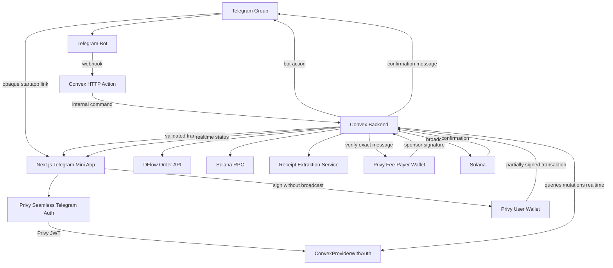
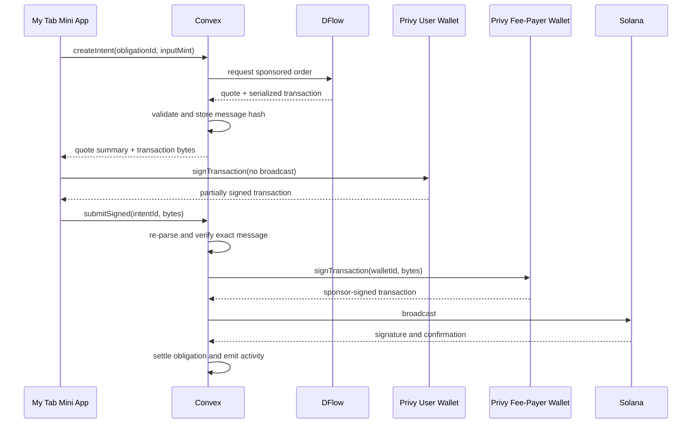
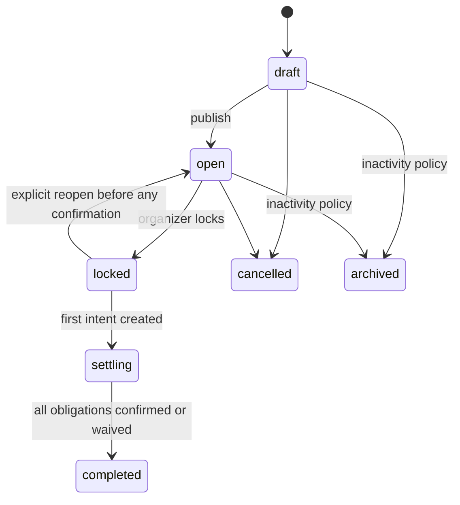
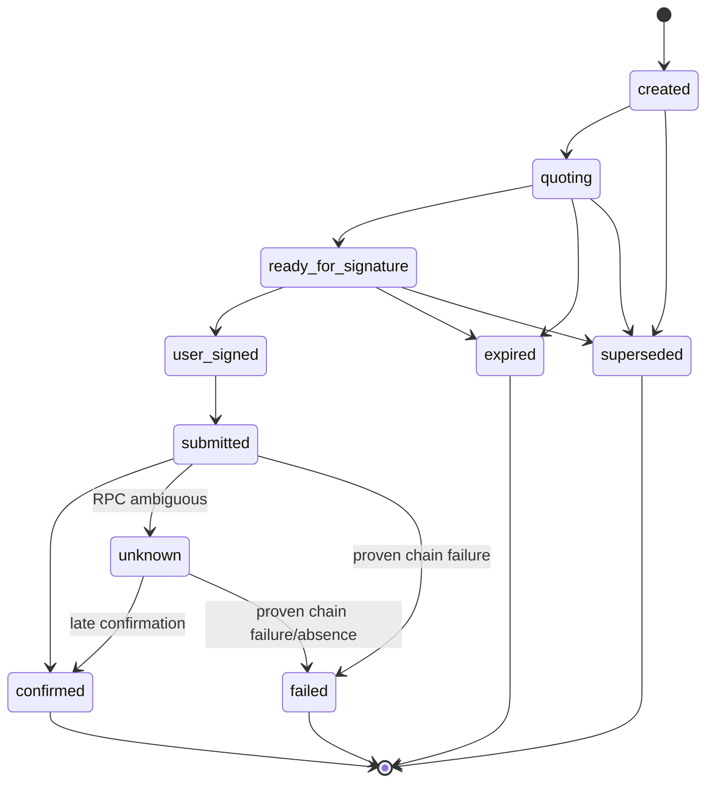

> ## ⚠ Amendment notice — read `docs/DECISIONS.md` first
>
> **This document remains the authority** for the product narrative, the judge story, the
> ten-day plan and the demo script. Its reasoning is why the system looks the way it does and
> is still worth reading in full. It is a **historical record**, not a description of the
> current build.
>
> Superseded, with reasoning in **`docs/DECISIONS.md`** (binding):
>
> - §1 **binding decision 2** — *"The bot must be a group administrator."* Scoped to
>   group-origin tabs; bot-admin is an upgrade, not a prerequisite (**D-06**). Its consequence
>   clause — that a membership failure disables mutations — no longer blocks paying an
>   already-locked obligation (**D-07**).
> - §1 **binding decision 4** / §2.8 — `tab_session` now carries a **seat policy**
>   (`{kind:"chat"}` or `{kind:"fixed", seats:n}`) (**D-06**).
> - §1 **binding decision 7** — *"SOL is the single routed P0 input."* Superseded: any token
>   the payer holds, subject to verification (**D-05**).
> - §1 **binding decision 10** / §6.1 — the platform fee is **omitted entirely** from the DFlow
>   request, not declared as zero; a declared fee is charged against the slippage budget
>   (**D-04**). DFlow is the settlement path for every non-USDC payer, not a one-token proof
>   point (**D-03**).
> - Devnet-first sequencing throughout — DFlow serves **mainnet only** (**D-01**).
> - Fixture-mode delivery throughout — no fixture or demo data ships in source (**D-11**).


# My Tab Hackathon Project Brief

**Version:** 1.4<br>
**Date:** August 21, 2026<br>
**Working assumption:** the judged milestone is ten days with a four-person team, but the approved product scope is not cut to fit that milestone. AI-assisted delivery continues after the judged slice until all 70 approved stories meet their acceptance criteria. The product remains a Telegram Mini App with Solana settlement, DFlow routing, Next.js App Router, Convex backend, Privy authentication and wallets, Astryx UI, and coordinated Vercel plus Convex deployment.

---

## 1. Executive Decision

My Tab should not enter the hackathon as a broad "Splitwise on Solana" clone. That scope is too wide, visually familiar, and technically unfocused.

Build one memorable product loop:

1. A Telegram group starts a bill.
2. Participants open the same Mini App session and claim their items.
3. My Tab calculates each obligation with transparent tax, service-charge, discount, and tip rules.
4. A participant chooses an allowed payment token.
5. The recipient receives USDC while a dedicated Privy-managed fee-payer wallet sponsors the Solana fee.
6. The bill updates live and the bot posts a polished confirmation into the group.

The product should feel like a social coordination app with invisible crypto infrastructure, not a wallet interface with expense features attached.

### Product thesis

> **My Tab is the group tab that lives in Telegram. Start it, split it, tip the crew, and settle without leaving the chat.**

### Hackathon wedge

The winning wedge is the combination of:

- Telegram group context.
- Item-level bill claiming.
- A first-class tipping flow.
- Live balance and settlement tracking.
- Gas-sponsored Solana settlement.
- Optional token conversion through DFlow.
- A polished, branded mobile experience.

### The single hardest dependency

The team must prove one production-shaped path before building the full bill editor:

1. Open My Tab from a Telegram Mini App link.
2. Complete Privy's seamless Telegram authentication.
3. Provision or restore a Solana embedded wallet.
4. Authenticate the Convex WebSocket with a Privy-issued JWT.
5. Build one exact USDC transfer with the dedicated Privy fee-payer address.
6. Sign it with the user's Privy wallet without broadcasting.
7. Verify the exact transaction in Convex, add the Privy fee-payer signature, broadcast, and confirm.
8. Persist the result in Convex and post it back into Telegram.

This identity-to-wallet-to-realtime-to-chain path carries more schedule risk than bill arithmetic or visual polish.

### Implementation-readiness decisions — binding

The 2026-08-21 audit accepted the following decisions. They refine sequencing and safety; they do not remove any approved feature.

1. **Telegram ingress belongs to Convex.** Bot webhooks and Mini App launch validation terminate at Convex HTTP Actions. The webhook action verifies Telegram's secret header and calls internal functions. Authenticated `/telegram/bootstrap` requires the Privy bearer JWT plus raw `initData`, validates HMAC/freshness/replay/session token, and creates or refreshes a five-minute server-side context through an internal mutation. Same-DID reload is idempotent; cross-DID reuse is rejected. Vercel never forwards a trusted domain write into a public Convex mutation.
2. **Telegram membership is authoritative.** The bot must be a group administrator. Convex consumes membership updates and refreshes `getChatMember` before join and whenever a privileged-action cache is older than five minutes. A membership or bot-admin failure leaves the tab readable but disables mutations with an organizer repair message.
3. **Authentication and tab scope are separate.** A Privy JWT proves the person; authenticated Convex bootstrap verification creates a five-minute server-side Telegram context proving the active group/session; a reusable opaque tab-session token selects the bill. Outside Telegram, the sanitized shared summary is read-only.
4. **Token classes are explicit.** `tab_session` and `tip_session` links may be revisited within TTL and authorization scope. A `single_use_action` token is subject- and purpose-bound and is atomically consumed once. Raw tokens are never stored.
5. **Money has one canonical net unit.** Every obligation stores its bill-currency minor amount and its locked USDC atomic target. Group netting uses USDC atomic units only; cross-currency fiat figures are never summed.
6. **THB FX is deterministic.** Production uses Frankfurter v2 `USD/THB` filtered to the Bank of Thailand provider. Snapshots store `numeratorAtomic/denominatorMinor` in the direction `USDC_ATOMIC_PER_THB_MINOR`; recipient targets round upward. Freshness is 36 hours from provider date on weekdays and 96 hours across weekends/Thai bank holidays. Production fails closed when stale/unavailable; a visibly badged manual rational exists only outside production. Locked snapshots never refresh silently.
7. **SOL is the single routed P0 input.** Native SOL is normalized only inside the server to wrapped-SOL mint `So11111111111111111111111111111111111111112`; the UI calls it "Solana." Recipient output is mainnet USDC mint `EPjFWdd5AufqSSqeM2qN1xzybapC8G4wEGGkZwyTDt1v`. DFlow is requested sync-only with `allowSyncExec=true` and `allowAsyncExec=false`; any asynchronous response is rejected.
8. **User-signed or submitted money is never expired as a quote.** AD-21 defines the only persisted intent states: `created | quoting | ready_for_signature | user_signed | submitted | unknown | confirmed | failed | expired | superseded`. Normal progress is `created → quoting → ready_for_signature → user_signed → submitted → confirmed|failed`, with `unknown` for ambiguous RPC observation. `awaiting_wallet`, `presigned`, and `confirming` are UI labels only. `user_signed`, `submitted`, and `unknown` block reopen/replacement until safely resolved. Late confirmations reconcile idempotently; definitive failure requires the binding proof.
9. **Waiver and manual cash are supported ledger offsets.** Only the obligation recipient may waive. Cash becomes an offset only after payer and recipient acknowledge the same terms; an organizer has no unilateral authority unless they are the recipient. Both are capped to the remaining obligation, immutable, and audited, and neither masquerades as on-chain settlement.
10. **The judged platform fee is zero.** No platform-fee account is sent to DFlow and no zero-fee row is shown. User copy says "price protection," never "slippage."
11. **Final UX is authoritative.** `DESIGN.md` owns Instrument Sans and the cool-paper/navy/deep-blue palette. Generated canvases and older brief values cannot override it.
12. **All approved work remains.** P0/P1 labels control risk order, not product inclusion. Receipt scanning, all split modes, round-up tips, celebration, debt compression, read-only web summary, external wallets, waivers, and cash settlement remain in the committed backlog.

---

## 2. Architecture Decisions That Change the Plan

### 2.1 Next.js App Router is the application shell

Use one Next.js application for the Telegram Mini App, public landing page, demo routes, and the optional Privy token-exchange fallback. Telegram bot and launch ingress terminate at Convex HTTP Actions. The Mini App itself remains client-heavy because Telegram APIs, Privy hooks, wallet signing, and Convex realtime subscriptions depend on the browser runtime.

Use Server Components only where they provide clear value, such as the public landing page or static documentation. Do not force the active bill room through server rendering.

### 2.2 Convex replaces Supabase, Drizzle, Fastify, and a separate realtime service

Convex owns:

- The application database.
- Realtime bill subscriptions.
- Queries and transactional mutations.
- External-service actions.
- Internal functions.
- Scheduled confirmation and expiration jobs.
- Receipt image storage.
- Authorization at the beginning of every public function.

Do not add PostgreSQL, Prisma, Supabase, Drizzle, Redis, or a second API server for the hackathon. That would destroy the simplicity gained by choosing Convex.

### 2.3 Privy is the identity and wallet layer

Privy owns:

- Seamless Telegram Mini App login.
- The canonical authentication session.
- The user's Privy DID.
- Solana embedded-wallet provisioning.
- Optional external Solana wallet connection.
- Transaction signing.
- Gas sponsorship.
- Wallet recovery and export controls.

Default to a Privy embedded Solana wallet created on login. External Solana-standard wallets are P1, not the default path.

### 2.4 Privy-to-Convex authentication is the custom seam

There is no reason to create a second login system. Feed Privy's short-lived access token into `ConvexProviderWithAuth`, then configure Convex as a custom JWT consumer.

Privy access tokens use `iss="privy.io"`, `aud=<Privy app ID>`, and ES256 signatures. Privy gives the application a public verification key, while Convex custom JWT authentication expects a JWKS endpoint. The primary integration therefore exposes the app's Privy public verification key as JWKS through a stable Vercel route.

Expected Convex auth configuration:

```ts
// convex/auth.config.ts
import type {AuthConfig} from 'convex/server';

export default {
  providers: [
    {
      type: 'customJwt',
      applicationID: process.env.PRIVY_APP_ID!,
      issuer: 'privy.io',
      jwks: process.env.MYTAB_PRIVY_JWKS_URL!,
      algorithm: 'ES256',
    },
  ],
} satisfies AuthConfig;
```

Primary path:

1. Convert the Privy app's public verification key to JWK format.
2. Expose it from `/.well-known/privy-jwks.json` on Vercel.
3. Ensure the JWK `kid` matches the actual Privy access-token header when one is present.
4. Adapt Privy's `ready`, `authenticated`, and `getAccessToken()` values to `ConvexProviderWithAuth`.
5. Return a newly refreshed token when Convex requests `forceRefreshToken`.

Required Day 0 test: inspect a real access token and prove issuer, audience, algorithm, `kid`, expiration, refresh, and Convex WebSocket authentication.

Fallback path: use a Vercel token-exchange route that verifies the Privy access token with `@privy-io/node`, issues a five-minute My Tab JWT, and exposes the My Tab public signing key through JWKS. Do not bypass Convex auth by accepting user IDs as function arguments.

Canonical identity mapping:

```text
Privy DID (`sub`)      -> authentication identity
Convex `users._id`     -> internal foreign key
Telegram user ID       -> linked social identity
Privy wallet ID        -> wallet-provider identifier
Solana address         -> payment address, never the user primary key
```

### 2.5 Vercel does not replace the Convex runtime

Vercel hosts:

- The Next.js application.
- Static assets.
- Privy webhook ingress if used.
- Optional auth-token exchange fallback.

Convex still executes Convex queries, mutations, actions, storage, crons, and realtime subscriptions on Convex infrastructure. Configure Vercel's build command as:

```bash
npx convex deploy --cmd 'npm run build'
```

Store `CONVEX_DEPLOY_KEY` in Vercel. Store DFlow, Telegram, Privy server, and RPC secrets in the runtime that consumes them, preferably Convex environment variables for Convex actions.

### 2.6 DFlow orders remain input-amount driven

A bill obligation is a target recipient amount, while DFlow starts from an input amount. Keep two settlement modes:

- Exact gas-sponsored USDC transfer.
- DFlow exact-input swap whose minimum output meets or exceeds the obligation.

Use a bounded quote solver and disclose any excess as a round-up tip or overpayment credit. Do not present an expected quote as a guaranteed exact output.

### 2.7 Use one explicit sponsored-transaction path

Use the same two-signature path for direct USDC payments and DFlow swaps:

1. Create a dedicated Solana fee-payer wallet managed by Privy.
2. Build or request a transaction whose fee payer is that wallet.
3. Validate and store the exact transaction message in Convex.
4. Ask the user's Privy embedded wallet to sign without broadcasting.
5. Send the partially signed transaction back to a Convex Node action.
6. Re-parse and verify it against the stored settlement intent.
7. Ask Privy's server SDK to add the fee-payer signature.
8. Broadcast through the server RPC and confirm on chain.

For DFlow, pass the Privy fee-payer address as `sponsor`, set `sponsorExec=false`, and keep the user as the swap executor. DFlow requires both user and sponsor signatures for this mode.

Do not mix three sponsorship mechanisms in the MVP. Privy's client-side `signAndSendTransaction({sponsor: true})` is a contingency only after the team proves it can be constrained to an intent-bound, server-validated DFlow transaction. The explicit co-sign path gives My Tab a hard verification gate before sponsor funds are exposed.

### 2.8 Telegram session context remains separate from authentication

Privy proves who the user is. The bot-generated opaque `startapp` token proves which bill session they are opening. Keep those concerns separate.

The bot stores the Telegram chat ID when it creates a session. The browser receives only an opaque selector token; authenticated `POST /telegram/bootstrap` validates the Privy JWT plus raw Telegram `initData` and creates a five-minute server-side context binding the Privy subject to the Telegram user, chat, group, and session. `tab_session` and `tip_session` tokens are intentionally reusable by authorized members within TTL, while `single_use_action` tokens are atomically consumed once. The client must never supply a trusted chat ID, Telegram ID, recipient address, or bill owner ID.

### 2.9 Receipt intelligence remains invisible infrastructure

Use a model to extract receipt data into an editable schema. The deterministic Convex domain functions calculate every amount. The UI says **Scan receipt**, not **Ask AI**, **Magic Receipt**, or **AI split**.

---

## 3. Product Definition

### 3.1 Problem

Shared payments fail for three reasons:

- The group cannot agree on who consumed what.
- One person carries the administrative burden.
- The final payment step sits outside the expense tool and creates friction.

Existing expense apps organize debts well, but they often stop before settlement or rely on regional payment methods. Crypto payment tools settle value, but they tend to expose token, wallet, gas, routing, and address complexity.

My Tab combines coordination and settlement inside a Telegram group.

### 3.2 Target users

#### Primary: Social group organizer

Examples: dinner host, trip organizer, roommate, team lead, community admin.

Needs:

- Start a bill quickly.
- Invite people without another account-registration flow.
- See who has claimed items and who has paid.
- Avoid chasing people manually.

#### Secondary: Participant or payer

Needs:

- Join with one tap.
- See only relevant items and a clear total.
- Understand every adjustment.
- Pay without learning Solana mechanics.

#### Tertiary: Tip sender and recipient

Needs:

- Send a fast social payment with a message or reaction.
- Let the sender pay with an allowed token.
- Receive a preferred stable asset.
- See immediate social confirmation.

### 3.3 Jobs to be done

- "When a group finishes a meal, help us agree on each share and settle before anyone leaves."
- "When one person covers a group expense, show everyone what they owe and who has paid."
- "When someone helps the group, let me tip them in seconds without asking for a wallet address."
- "When several bills accumulate, show my current position without making me inspect every transaction."

### 3.4 Product principles

1. **Amount first:** Show the obligation before token details.
2. **One clear action:** Every screen gets one dominant next step.
3. **Explain the math:** Tax, service charge, discounts, tip, and rounding stay inspectable.
4. **Social context over wallet context:** Use names, avatars, and group language before addresses and mints.
5. **Deterministic money:** All arithmetic uses integer units and audited rules.
6. **Progressive disclosure:** Hide routing, price protection, and network data until requested. Never expose the term "slippage" in product copy.
7. **Live confidence:** Participants can see who joined, claimed, locked, and paid.
8. **No dead ends:** Every AI, quote, wallet, or network failure has a manual or retry path.

---

## 4. Hackathon Success Criteria

My Tab succeeds when the judges can understand and witness the complete loop without a technical explanation.

| Goal | Acceptance target |
|---|---|
| Product comprehension | A judge understands the product within 15 seconds. |
| Group onboarding | A participant joins a bill from Telegram in one tap. |
| Split accuracy | Participant totals reconcile exactly to the locked bill total. |
| Settlement | At least one live sponsored Solana payment confirms during the demo. |
| DFlow proof | At least one payment converts an allowlisted input token into recipient USDC. |
| Tipping | A tip can be composed, paid, and acknowledged independently of a bill. |
| Live coordination | Item claims and payment status update without a full page refresh. |
| Polish | The flow uses consistent branding, motion, haptics, loading, empty, error, and success states. |
| Reliability | The demo has a deterministic fallback for receipt import, FX, and network failure. |

### North-star demo metric

**Time from Telegram bill link to confirmed payment:** target under 90 seconds for a returning wallet user.

### Supporting metrics

- Bill completion rate.
- Median time to claim all items.
- Quote-to-sign conversion.
- Confirmed settlement rate.
- Average outstanding balance age.
- Tips sent and received.
- Requote and transaction-expiration rate.

---

## 5. Judge-Facing Story

### 5.1 Ninety-second demo

**0 to 10 seconds: Problem**<br>
A dinner group has one receipt, five people, shared dishes, and no one wants to calculate or chase payments.

**10 to 20 seconds: Start**<br>
The organizer runs `/tab` in Telegram, with `/splitbill` retained as an alias. Telegram calls the single Convex HTTP Action ingress, which verifies the webhook secret and durably invokes internal Convex handling; the bot then posts an “Open tab” button.

**20 to 35 seconds: Capture**<br>
The organizer photographs a Thai or English receipt. My Tab extracts the items into an editable receipt. For the safest live demo, keep a preloaded sample receipt one tap away.

**35 to 50 seconds: Collaborate**<br>
Participants open the same session. Each person taps the items they ordered. A shared dish gets split between two avatars. The live footer reaches "All items assigned."

**50 to 65 seconds: Review**<br>
The organizer locks the bill. The app shows each obligation, proportional service charge, tax, and a group tip. One participant adds a small personal round-up tip.

**65 to 82 seconds: Settle**<br>
A participant owes 291.74 THB equivalent, chooses Solana, and sees that the organizer receives USDC. Privy presents one branded confirmation, sponsors the network fee, and signs from the user’s embedded Solana wallet.

**82 to 90 seconds: Social proof**<br>
The payment card changes to "Paid," the group progress ring advances, and the bot posts a branded confirmation. The app shows the remaining balance and a "Tip the organizer" action.

### 5.2 Three wow moments

1. **The receipt becomes a collaborative claim board.**
2. **The payer chooses one token while the recipient gets another, with no SOL requirement.**
3. **The Telegram group sees the bill settle live.**

### 5.3 Demo fallback plan

- Include a "Use demo receipt" control hidden behind a long press or demo flag.
- Pre-fund one organizer wallet and one Privy test user with tiny mainnet balances.
- Restrict the live swap to one known liquid pair.
- Cache the Frankfurter v2 `USD/THB` Bank of Thailand-provider snapshot; fail closed in production and retain a visibly badged manual rational only outside production.
- Record a clean backup video before submission.
- Keep the exact USDC user-sign-plus-fee-payer-co-sign path available when DFlow quoting is unavailable.

---

## 6. Scope

These are delivery lanes, not scope boundaries. P0 retires production risk first and P1 follows it; all 70 approved stories remain committed and none of the capabilities below is removed by missing the ten-day judged milestone.

### 6.1 P0: Required for the judged MVP

| Area | Required capability |
|---|---|
| Telegram | `/tab` with `/splitbill` as an alias, `/tip`, opaque deep links, Privy seamless Telegram login, Convex HTTP Action ingress, bot-admin membership verification, and bot status updates. |
| Bill creation | Create bill, set title, currency, payer, recipient wallet, items, tax, service charge, discount, and tip. |
| Participation | Join session, show Telegram avatar/name, claim and unclaim items, split a shared item equally. |
| Calculation | Exact integer arithmetic, proportional adjustments, visible rounding, total reconciliation. |
| Locking | Organizer locks a revision before settlement. No silent post-lock edits. |
| Balances | Show current bill obligation, group net position, outstanding amount, and payment progress. |
| Wallet | Privy embedded Solana wallet created or restored on login, with optional external-wallet support deferred. |
| Stable payment | Exact USDC transfer using the user signature plus the dedicated Privy-managed fee-payer signature. |
| DFlow payment | Native SOL routed synchronously to mainnet USDC through the bounded target-output solver and the same two-signature path. |
| Tipping | Send a direct tip with presets, custom amount, message, and optional round-up. |
| Settlement tracking | Quoted, awaiting signature, submitted, confirmed, failed, and expired states. |
| History | Recent bills, tips, and settlements with an explorer link. |
| Design | Complete branded light Astryx theme, responsive Telegram layout, haptics, motion, errors, skeletons, and empty states. |

### 6.2 P1: Judge-wow features after the payment path works

| Feature | Reason to include |
|---|---|
| Receipt scan | Visually compelling and removes the most tedious input step while keeping AI out of the brand language. |
| Thai and English receipt handling | Gives My Tab a credible Bangkok launch angle. |
| Additional solver hardening | The bounded target-output solver is P0; P1 expands route tuning, diagnostics, and additional input assets. |
| Live claim presence | Shows avatars currently viewing or editing the bill. |
| Personal round-up tip | Connects the split and tipping stories naturally. |
| Payment celebration card | Creates a shareable, memorable Telegram moment. |
| Lightweight debt compression | Reduces settlement paths for groups with multiple payers. |
| Read-only web summary | Lets non-wallet users inspect the split. |

### 6.3 Explicit non-goals for the hackathon

- Arbitrary memecoin support.
- Multiple recipient wallets within one bill.
- Prediction-market tips.
- Full merchant dashboard.
- Group treasury and voting.
- Recurring subscriptions or automated charges.
- Cross-group debt netting.
- Installment payments.
- Refund automation.
- Full accounting exports.
- AI-generated participant assignments from chat history.
- Universal receipt OCR across every layout and language.
- Production custody, card payments, bank transfers, or fiat on-ramp.
- Complex reputation systems, badges, and leaderboards.

---

## 7. Core User Flows

## 7.1 Direct tipping flow

This should be the first completed end-to-end payment feature because it isolates the wallet and settlement risk.

1. User opens My Tab from `/tip`, a group action, or the Tabs screen.
2. Privy completes seamless Telegram login and restores or creates the embedded Solana wallet.
3. User selects a Telegram group member.
4. User chooses a preset or custom amount.
5. User adds an optional note or reaction.
6. Recipient asset defaults to USDC.
7. Sender selects USDC or one allowlisted swap token.
8. My Tab shows:
   - Sender spends.
   - Recipient receives at least.
   - Platform fee.
   - Sponsored network fee.
   - Quote expiration.
9. User signs once through Privy without broadcasting.
10. Convex verifies, sponsor-signs, broadcasts, and tracks confirmation.
11. Bot posts a branded tip card after confirmation.

### Tip acceptance criteria

- Recipient wallet comes from the Convex wallet record synchronized from Privy, not a client-supplied address.
- The sender cannot alter the recipient, amount, output mint, or sponsor after quote creation.
- The same intent cannot be paid twice.
- A failed or expired quote can be recreated without duplicating the tip record.

## 7.2 Bill-splitting flow

1. Organizer starts `/tab` or `/splitbill` in a Telegram group.
2. Bot creates a bill session and stores the Telegram chat ID.
3. Bot posts a direct-link button with an opaque session token.
4. Organizer enters items manually or imports a receipt.
5. Participants join from the same link.
6. Participants claim items.
7. Shared items support equal split in P0.
8. Organizer reviews unassigned items and discrepancies.
9. Organizer sets the group tip policy.
10. Organizer locks the bill revision.
11. My Tab creates immutable obligations.
12. Participants pay independently.
13. UI and bot update after each confirmed transaction.
14. Bill completes when every required obligation is settled or manually waived.

## 7.3 Group-balance flow

1. User opens a group.
2. Header shows one plain-language state:
   - "You owe 18.40 USDC"
   - "You are owed 42.10 USDC"
   - "All square"
3. User sees active bills, recent payments, and unresolved obligations.
4. User can settle a current obligation or inspect the source bill.
5. Confirmed settlements offset the ledger automatically.

P0 should derive balances across bills in one group. It should not attempt cross-group netting.

## 7.4 Organizer adjustment flow

1. Organizer opens an unlocked bill.
2. Organizer changes an item, participant, adjustment, or policy.
3. Server increments the bill revision.
4. All clients receive the update.
5. Once locked, edits require an explicit reopen-and-recalculate action.
6. Any existing quotes expire when the bill revision changes.

---

## 8. Information Architecture

### 8.1 Primary navigation

Keep the global navigation shallow and on-brand:

- **Tabs** — groups, open bills, balances, and the start-tab action.
- **Activity** — claims, edits, tips, requests, and confirmed settlements.
- **You** — Privy wallet, receiving preference, notifications, and account state.

A deep-linked bill opens directly into the active tab and temporarily hides global navigation.

### 8.2 Screen inventory

| Screen | Purpose | Primary action |
|---|---|---|
| Launch/Auth | Validate Telegram session and restore state. | Continue automatically. |
| Tabs | Show net position, groups, open tabs, and quick actions. | Start a tab / Send a tip. |
| Group | Show group balance, participants, open tabs, and activity. | Start a tab. |
| New Tab | Set title, payer, currency, and capture method. | Add items. |
| Receipt Review | Correct extracted merchant, items, and totals. | Confirm receipt. |
| Claim Board | Assign items with participant chips and live totals. | Finish claiming. |
| Bill Review | Show exact per-person breakdown and policies. | Lock bill. |
| Payment Sheet | Select token and inspect settlement quote. | Pay now. |
| Payment Progress | Show wallet, submission, and confirmation state. | Return to bill. |
| Tip Composer | Select recipient, amount, note, and token. | Send tip. |
| Activity | Show bills, tips, adjustments, and settlements. | Open event. |
| You | Manage the Privy wallet, receiving preference, and export controls. | Manage wallet. |

### 8.3 Tabs screen hierarchy

1. **Balance hero:** "You owe," "You are owed," or "All square."
2. **Two primary actions:** Start a tab and Send a tip.
3. **Open tabs:** Progress and remaining amount.
4. **Groups:** Avatar stacks and current position.
5. **Recent activity:** Compact social feed.

Do not make charts the first screen. Judges need a clear action and state, not analytics decoration.

### 8.4 Claim-board layout

Each item row contains:

- Item name and quantity.
- Price.
- Assigned participant avatars.
- "Claim" or "Shared" action.
- Warning state when unassigned.

Sticky footer contains:

- Assigned amount versus receipt total.
- Count of unassigned items.
- Current participant subtotal.
- Main action.

### 8.5 Payment-sheet hierarchy

1. Obligation amount in bill currency.
2. Recipient and destination asset.
3. Payment-token selector.
4. Maximum sender spend.
5. Minimum recipient receive.
6. Optional round-up tip.
7. Collapsed detail row for route, price protection, and the sponsored network fee. The judged build has no platform-fee row.
8. One fixed bottom action.

Do not lead with wallet addresses, token mints, or transaction bytes.

---

## 9. Brand, Voice, and Visual System

### 9.1 Brand hierarchy

**Product name:** My Tab<br>
**Category descriptor:** *The group tab that lives in Telegram.*<br>
**Primary launch line:** *Start it. Split it. Settle it.*<br>
**Supporting line:** *Your group. Your bill. Your way.*<br>
**Success line:** *Your group tab. Settled.*<br>
**Engineering slug:** `mytab`

Use one message per surface. “Your group. Your bill. Your way.” stays supporting copy because the P0 does not yet support every possible split and settlement policy.

### 9.2 Positioning

> **My Tab turns a Telegram group into a live shared tab where people claim what they had, see what they owe, tip each other, and settle in place.**

The product is social before financial and familiar before technical. It should never present itself as a DeFi terminal, wallet dashboard, accounting system, chatbot, or “AI app.”

### 9.3 Visual direction

Use Astryx as the component and token foundation. Build a custom, light-only My Tab theme for the hackathon:

- Cool paper canvas.
- Crisp white surfaces.
- Border-led depth and restrained shadows.
- Deep blue primary actions.
- Burnished terracotta tips and celebrations.
- Mint paid and settled states.
- Coral owed and failed states.
- Large tabular amounts.
- Avatars and group names before wallet addresses or token symbols.

### 9.4 Core tokens

| Token | Hex | Use |
|---|---:|---|
| Tab Blue | `#1E51D2` | Primary actions, selection, links, focus. |
| Tab Blue Soft | `#E7EDFC` | Selected rows and active chips. |
| Tab Blue Deep | `#17409F` | Pressed and hover states. |
| Paper | `#F4F7FA` | App canvas. |
| Surface | `#FFFFFF` | Cards, sheets, inputs. |
| Sunk | `#EDF2F7` | Inset panels. |
| Ink | `#0A2038` | Primary text. |
| Muted Ink | `#55677D` | Metadata and helper text. |
| Subtle Ink | `#61748B` | Micro-labels. |
| Border | `#DFE7EF` | Dividers and boundaries. |
| Border Strong | `#C6D2DE` | Strong boundaries. |
| Tip | `#A85F2E` | Tip and celebration accent. |
| Settled | `#0B7561` | Paid, received, all square. |
| Owed | `#B32B44` | Owed, failed, disputed, destructive. |
| Warning | `#9A6209` | Unassigned items and quote expiration. |

### 9.5 Astryx standard

- Extend `@astryxdesign/theme-neutral`.
- Force `mode="light"` for the judged build.
- Use Astryx for common controls, cards, forms, sheets, avatars, progress, badges, skeletons, and empty states.
- Build custom components only for receipt rows, item claiming, split allocation, tip composition, and settlement progress.
- Do not combine Astryx with shadcn/ui or another full component system.

### 9.6 Typography and layout

Use Instrument Sans with system fallbacks, 15px base body size, 34 to 42px balance amounts, tabular numerals, and 44px minimum touch targets. Use a 4px spacing scale, 16px narrow-screen gutters, 20px cards, and restrained one-pixel borders. `DESIGN.md` is authoritative for the complete token set.

### 9.7 Product voice

Use:

- “Start a tab”
- “Claim yours”
- “2 items need an owner”
- “You owe ฿291.74”
- “Ready to settle”
- “Tip sent”
- “All square”
- “Quote expired. Refresh it.”

Avoid:

- “Execute swap”
- “Approve route”
- “Destination ATA”
- “Broadcast transaction”
- “AI-powered split”
- “Insufficient lamports”

### 9.8 Visual anti-patterns

Reject dark-first presentation, purple-blue AI gradients, glassmorphism, neon crypto colors, token logos as navigation, sparkle icons for receipt scanning, chart walls, and a rounded card around every section.

---

## 10. Functional Requirements

### 10.1 Authentication and identity

- Privy is the canonical authentication provider.
- Enable Telegram seamless login in the Privy dashboard.
- Use the Privy DID from the verified JWT as the external authentication subject.
- Feed Privy access tokens into `ConvexProviderWithAuth`.
- Every public Convex query, mutation, and action that exposes private data checks `ctx.auth.getUserIdentity()`.
- Synchronize the Solana wallet from a server-verified Privy user or identity token, and bind the Telegram identity only after server-side `initData` validation.
- Never trust a browser-supplied Privy DID, Telegram ID, wallet ID, or wallet address.
- Map the opaque `startapp` token to a bill session in Convex.
- Classify opaque tokens as reusable `tab_session`/`tip_session` selectors or subject- and purpose-bound `single_use_action` tokens. Reject expired, revoked, wrong-scope, unauthorized, and single-use replay; do not reject an authorized tab revisit merely because another member used the link.
- Require a fresh server-side Telegram context from authenticated Convex bootstrap for every authenticated mutation. Outside Telegram, expose only the sanitized read-only summary.

### 10.2 Users and wallets

- Create or restore one Privy embedded Solana wallet on login.
- Store Privy wallet ID and Solana address in Convex.
- Allow one default receiving wallet per user.
- Mark embedded and external wallets distinctly.
- Support external Solana wallets as P1 only.
- Do not store private keys, seed phrases, or exported wallet material.

### 10.3 Groups

- Create or resolve a My Tab group from the Telegram chat recorded by the bot webhook.
- Maintain display name, avatar, join state, role, and wallet readiness.
- Show group default currency and recipient asset.
- Support multiple open tabs but optimize for one active tab.
- Do not infer Telegram group membership from client claims.
- Require bot-administrator status; consume membership updates and refresh `getChatMember` before join and on stale privileged-action membership caches.

### 10.4 Bills

- Create draft bill.
- Set payer, recipient, display currency, merchant, title, and FX snapshot.
- Add, edit, duplicate, and remove items while unlocked.
- Add tax, service charge, discount, and tip adjustments.
- Maintain a monotonically increasing revision.
- Lock the bill before settlement intents exist.
- Expire every quote when the bill revision changes.

### 10.5 Item allocation

P0 modes:

- One participant.
- Equal split across selected participants.

P1 modes:

- Quantity consumed.
- Custom percentage.
- Custom fixed amount.

Every claim mutation must be atomic, authorized, revision-aware, and visible through Convex realtime subscriptions.

### 10.6 Adjustments and calculations

Support fixed or percentage tax, service charge, tip, and discount. Allocate proportionally, equally, organizer-absorbed, or custom according to an explicit policy. Use integer atomic units and deterministic remainder distribution.

### 10.7 Balances and activity

- Show bill-level obligation and group net position.
- Separate quoted, awaiting signature, submitted, confirmed, failed, and expired payment states.
- Do not reduce confirmed debt from a merely submitted transaction.
- Preserve the source bill behind every balance.
- Emit immutable activity events for claims, edits, locks, tips, payments, waivers, and manual cash settlement.
- Treat waivers as recipient-only immutable offsets and cash as payer-plus-recipient dual-acknowledged immutable offsets, capped to the remaining obligation and fully audited; an organizer has no unilateral authority unless they are the recipient, and neither is labeled on-chain settlement.

### 10.8 Tipping

- Direct tip to a verified group participant.
- Presets and custom amount.
- Optional message and reaction.
- Round-up tip from a bill payment.
- Recipient receives USDC in P0.
- Sender pays USDC or one allowlisted DFlow input token.
- The recipient address comes from Convex, not the request body.

### 10.9 Settlement

- Create a server-owned settlement intent before requesting any transaction.
- Bind intent to user, wallet, bill revision, obligation, recipient, input mint, output mint, maximum input, minimum output, and expiry.
- Build exact USDC transfers in a Convex Node action.
- Request DFlow orders in a Convex action.
- Validate the serialized transaction before returning it to the client.
- Sign and send through Privy.
- Allow the Privy fee-payer wallet to sign only intents that pass server policy.
- Persist the returned transaction signature.
- Confirm against Solana before updating the ledger.
- Block duplicate payment and stale-revision payment.

### 10.10 Receipt scan

- Upload receipt images through Convex storage.
- Run extraction in a Convex action.
- Store raw extraction, confidence, reconciliation status, and model metadata.
- Require organizer confirmation before creating bill items.
- Never let model output become a final obligation without deterministic recalculation.

---

## 11. Calculation and Ledger Rules

### 11.1 Money representation

- Fiat amounts: signed 64-bit integer in minor units.
- THB: store satang even when the UI shows whole baht.
- Crypto amounts: atomic-unit integer represented as `bigint` or decimal string across JSON boundaries.
- Never use JavaScript floating-point numbers for persisted money.
- Store mint decimals with the quote and settlement record.

### 11.2 Split invariant

For every locked bill:

```text
sum(participant item shares)
+ sum(participant tax shares)
+ sum(participant service-charge shares)
+ sum(participant tip shares)
- sum(participant discount shares)
= locked bill total
```

The server rejects a lock when this invariant fails.

### 11.3 Equal item split

Use integer division plus a largest-remainder allocation:

1. Divide the item total by selected participant count.
2. Assign the floor amount to each participant.
3. Distribute remaining minor units deterministically by stable participant order.

This preserves the exact item total.

### 11.4 Proportional tax, service charge, tip, and discount

1. Compute each participant's pre-adjustment subtotal.
2. Multiply by the adjustment amount.
3. Divide by the total eligible subtotal.
4. Floor each share.
5. Distribute remaining minor units by largest fractional remainder.
6. Persist the final allocated shares, not only the formula.

### 11.5 Locked snapshots

When the organizer locks a bill, persist:

- Bill revision.
- Item snapshot.
- Allocation snapshot.
- Adjustment policy snapshot.
- FX snapshot.
- Final obligation per participant.
- Target settlement asset and recipient.

Quotes reference this snapshot. A later edit creates a new revision and invalidates the old quotes.

### 11.6 Ledger model

Treat each obligation and settlement as an immutable ledger event.

Example:

```text
Bill obligation: Andre owes Maya 8.25 USDC equivalent
Settlement: Andre paid Maya 8.25 USDC
Net group position: 0.00 USDC
```

Do not overwrite an obligation to mark it paid. Add a settlement event that offsets it.

### 11.7 Debt compression

For P1, calculate each group member's net position and greedily match debtors with creditors. This reduces payment count and guarantees no more than `n - 1` transfers for `n` non-zero participants. Do not claim that the greedy result always finds the mathematical minimum number of transfers.

### 11.8 FX, canonical net unit, and non-chain offsets

Each obligation persists two amounts:

- `displayAmountMinor`, in the locked bill currency for explanation and receipt reconciliation.
- `settlementAmountAtomic`, in USDC atomic units for settlement and ledger netting.

USDC atomic units are the sole canonical group-net unit. Never sum THB, USD, or another fiat amount across bills. A current fiat rendering of a group net is informational, must show its rate timestamp, and never changes ledger truth.

THB-to-USDC snapshots carry `direction="USDC_ATOMIC_PER_THB_MINOR"`, positive integers `numeratorAtomic` and `denominatorMinor`, `provider:'frankfurter:BOT'`, `providerAsOf`, `fetchedAt`, and `expiresAt`. Convert with `ceil(displayAmountMinor * numeratorAtomic / denominatorMinor)` so the recipient target is never short. Production uses Frankfurter v2 `USD/THB` filtered to the Bank of Thailand provider, with USDC treated as one USD for this product contract, and never parses the provider decimal through a JavaScript number. Freshness is 36 hours from provider date on weekdays and 96 hours across weekends/Thai bank holidays. Production fails closed; a visibly badged manual rational is permitted only outside production. A locked bill never silently refreshes its FX snapshot.

Waivers and manual-cash settlements are immutable ledger offsets, not mutable obligation status. Only the obligation recipient may waive. Cash becomes final only after payer and recipient acknowledge the same amount, currency, and method; an organizer has no unilateral authority unless they are the recipient. Neither may exceed the remaining amount, and each records actors, reason, timestamps, amount, currency, and method. Completion is derived from confirmed on-chain settlements plus dual-acknowledged cash and recipient-authorized waiver offsets, each applied exactly once.

---

## 12. Receipt Scan: AI-Assisted, Not AI-Branded

### 12.1 Purpose

The AI feature should remove manual data entry and create a visible transformation during the demo. It should not own accounting decisions.

### 12.2 Input

- Receipt photo from Telegram Mini App camera or upload.
- Optional locale hint.
- Optional currency hint.

### 12.3 Structured output

```ts
type ReceiptExtraction = {
  merchantName?: string;
  currency: "THB" | "USD" | "USDC" | "UNKNOWN";
  purchasedAt?: string;
  items: Array<{
    name: string;
    quantity: number;
    unitPriceMinor?: string;
    lineTotalMinor: string;
    confidence: number;
  }>;
  subtotalMinor?: string;
  taxMinor?: string;
  serviceChargeMinor?: string;
  discountMinor?: string;
  totalMinor: string;
  overallConfidence: number;
  warnings: string[];
};
```

### 12.4 Reconciliation pipeline

1. Normalize image orientation and size.
2. Run vision extraction with strict schema output.
3. Parse every amount into integer minor units.
4. Recalculate line totals and subtotal deterministically.
5. Compare extracted components against total.
6. Flag mismatches and low-confidence fields.
7. Require user confirmation before adding items to the bill.

### 12.5 UI behavior

- High-confidence fields appear normally.
- Low-confidence fields receive an amber outline.
- Mismatched totals show a sticky discrepancy card.
- User can edit every field.
- "Use sample receipt" remains available under demo mode.

### 12.6 Thai receipt differentiation

Target a limited Thai receipt subset:

- Thai and English item text.
- Thai baht symbols and abbreviations.
- Arabic and Thai numerals where supported.
- Service charge and VAT rows.
- Whole-baht and two-decimal formats.

Do not promise universal Thai OCR. Show a tested restaurant receipt format.

### 12.7 Features to reject during the hackathon

- Guessing who ordered each item from chat history.
- Automatic dispute resolution.
- Model-generated final totals.
- Automatic currency trades based on model advice.
- Free-form AI agents with authority to sign or submit payments.

---

## 13. Technical Architecture

### 13.1 Architecture decision

Use a single Next.js repository with a colocated Convex backend. Do not create a monorepo or separate API service until the product proves it needs one.

```text
my-tab/
  app/
    (miniapp)/
      page.tsx
      tabs/[publicToken]/page.tsx
      activity/page.tsx
      you/page.tsx
    api/
      telegram/webhook/route.ts
      privy/webhook/route.ts
      auth/convex-token/route.ts      # fallback only
      .well-known/privy-jwks.json/route.ts
    layout.tsx
  components/
    providers/
    tabs/
    receipts/
    payments/
    tips/
    ui/
  convex/
    auth.config.ts
    schema.ts
    users.ts
    groups.ts
    bills.ts
    allocations.ts
    balances.ts
    tips.ts
    settlements.ts
    activity.ts
    receiptStorage.ts
    dflowActions.ts                  # "use node"
    solanaActions.ts                 # "use node"
    privyActions.ts                  # "use node"
    telegramActions.ts
    crons.ts
    internal/
  lib/
    money/
    telegram/
    solana/
    dflow/
    validation/
  public/
  next.config.ts
  package.json
```

### 13.2 Frontend

- Current stable Next.js App Router.
- React 19 or later.
- TypeScript.
- `@tma.js` or a thin Telegram Mini App adapter.
- `@privy-io/react-auth` and Solana hooks.
- `convex/react` realtime hooks.
- Astryx core plus the custom My Tab theme.
- `@solana/kit` for transaction parsing and construction.
- Zod at integration boundaries where Convex validators do not cover external data.
- Motion only for focused transitions.

Avoid TanStack Query for Convex data. Convex already owns subscriptions, cache invalidation, and optimistic updates. Use TanStack Query only for a truly external client-side API that cannot live behind a Convex action.

### 13.3 Provider composition

```tsx
'use client';

<TelegramRuntimeProvider>
  <PrivyProvider appId={process.env.NEXT_PUBLIC_PRIVY_APP_ID!} config={privyConfig}>
    <PrivyConvexProvider>
      <MyTabThemeProvider>
        {children}
      </MyTabThemeProvider>
    </PrivyConvexProvider>
  </PrivyProvider>
</TelegramRuntimeProvider>
```

`PrivyConvexProvider` wraps `ConvexProviderWithAuth` and adapts Privy's `ready`, `authenticated`, and `getAccessToken()` values to the Convex auth interface.

### 13.4 Convex function responsibilities

**Queries** read authorized application state and power live subscriptions.

**Mutations** perform deterministic, transactional state changes such as claiming an item, locking a bill, or recording a confirmed settlement.

**Actions** call DFlow, Privy, Telegram, receipt extraction, FX, and Solana RPC services. Node-dependent SDKs live in files beginning with `"use node"`.

**Internal functions** own privileged writes from actions and scheduled jobs.

**Crons and scheduled functions** expire quotes, retry confirmation, close stale sessions, and post delayed reminders.

### 13.5 Vercel route handlers

Route handlers are ingress adapters, not the domain backend.

- `/api/privy/webhook` verifies Privy's webhook signature and forwards wallet or transaction events when used.
- `/.well-known/privy-jwks.json` exposes only the Privy public verification key in JWK form.
- `/api/auth/convex-token` exists only if direct Privy JWT verification by Convex fails.

Do not put bill calculations, authorization, DFlow orchestration, or ledger writes in Vercel route handlers.

Telegram uses two Convex HTTP Actions instead: the bot webhook verifies `X-Telegram-Bot-Api-Secret-Token`, and the Mini App launch endpoint validates raw `initData` with the Convex-owned bot token. Each calls internal functions only; neither exposes a public domain mutation to Vercel.

### 13.6 Deployment

**Vercel** deploys the Next.js app and route handlers.

**Convex** deploys the database, queries, mutations, actions, storage, crons, and realtime service.

Vercel build command:

```bash
npx convex deploy --cmd 'npm run build'
```

Use Convex preview deployments for pull requests after the production path works. Do not let preview deployments send real Telegram messages or spend real sponsor funds.

### 13.7 Environment ownership

| Variable | Runtime | Exposure |
|---|---|---|
| `NEXT_PUBLIC_PRIVY_APP_ID` | Browser/Vercel | Public |
| `NEXT_PUBLIC_CONVEX_URL` or generated `CONVEX_URL` | Browser/Vercel | Public |
| `CONVEX_DEPLOY_KEY` | Vercel build | Secret |
| `PRIVY_APP_ID` | Convex auth config / server | Server |
| `MYTAB_PRIVY_JWKS_URL` | Convex auth config | Public Vercel endpoint value |
| `PRIVY_APP_SECRET` | Convex Node action or Vercel token verifier | Secret |
| `PRIVY_VERIFICATION_KEY` | Vercel JWKS route | Public key stored as server configuration |
| `PRIVY_SPONSOR_WALLET_ID` | Convex Node action | Secret wallet identifier |
| `PRIVY_SPONSOR_ADDRESS` | Convex actions and DFlow requests | Public Solana address |
| `TELEGRAM_BOT_TOKEN` | Convex action | Secret |
| `TELEGRAM_WEBHOOK_SECRET` | Convex HTTP Action | Secret |
| `DFLOW_API_KEY` | Convex action | Secret |
| `SOLANA_RPC_HTTP` / `SOLANA_RPC_WS` | Privy config and Convex actions | Public client endpoint or server secret depending on provider |
| Receipt model key | Convex action | Secret |

Never duplicate a secret across Vercel and Convex without a concrete runtime need.

### 13.8 System diagram



### 13.9 Trust boundaries

- Browser, Telegram client, and deep-link parameters are untrusted.
- Privy JWT becomes trusted only after Convex validates issuer, audience, signature, and expiry.
- A Telegram account and chat context become trusted only after server-side validation of raw Telegram Mini App `initData`.
- A Telegram group role becomes trusted only from verified membership updates or a fresh `getChatMember` check while the bot is an administrator.
- Convex public functions enforce authorization; the UI does not.
- DFlow responses are external input and require transaction inspection.
- Privy wallet signatures authorize the user's transaction, not the correctness of the bill.
- Solana confirmation is the source of truth for settlement finality.

---

## 14. Convex Data Model

### 14.1 Modeling rules

- Define every table and index in `convex/schema.ts`.
- Use Convex document IDs for internal relationships.
- Use Privy DID only as the external auth subject.
- Store money as integer minor or atomic units with `v.int64()` or decimal strings when an external SDK requires them.
- Never use JavaScript floating point for obligations, token amounts, fees, or FX calculations.
- Store timestamps as integer milliseconds.
- Store immutable snapshots for locked bills and confirmed ledger events.

### 14.2 Core tables

#### `users`

- `privyDid`
- `telegramUserId`
- `telegramUsername?`
- `displayName`
- `avatarUrl?`
- `defaultCurrency`
- `createdAt`
- `updatedAt`

Indexes: `by_privy_did`, `by_telegram_user_id`.

#### `wallets`

- `userId`
- `privyWalletId`
- `address`
- `chain: "solana"`
- `kind: "embedded" | "external"`
- `isDefaultReceive`
- `verifiedAt`
- `createdAt`

Indexes: `by_user`, `by_privy_wallet_id`, `by_address`.

#### `groups`

- `telegramChatId`
- `title`
- `photoUrl?`
- `defaultCurrency`
- `recipientAssetMint`
- `createdBy`
- `createdAt`

Index: `by_telegram_chat_id`.

#### `groupMembers`

- `groupId`
- `userId`
- `role: "owner" | "organizer" | "member"`
- `status: "active" | "left" | "blocked"`
- `joinedAt`

Indexes: `by_group`, `by_group_user`, `by_user`.

#### `billSessions`

- `groupId`
- `createdBy`
- `title`
- `merchantName?`
- `displayCurrency`
- `recipientUserId`
- `recipientWalletId`
- `status: "draft" | "open" | "ready" | "settling" | "completed" | "cancelled"`
- `revision`
- `subtotalMinor`
- `adjustmentMinor`
- `totalMinor`
- `fxSnapshot?`
- `lockedSnapshot?`
- `lockedAt?`
- `createdAt`
- `updatedAt`

Indexes: `by_group`, `by_group_status`, `by_creator`.

#### `publicSessionTokens`

- `billId`
- `tokenHash`
- `tokenClass: "tab_session" | "tip_session" | "single_use_action"`
- `purpose`
- `subjectUserId?`
- `expiresAt`
- `revokedAt?`
- `consumedAt?` (single-use only)
- `createdAt`

Never store a raw public token when a hash is sufficient. Reusable session tokens may be resolved repeatedly by authorized members; only `single_use_action` tokens are consumed.

#### `billItems`

- `billId`
- `name`
- `quantity`
- `unitPriceMinor`
- `lineTotalMinor`
- `position`
- `source: "manual" | "receipt"`
- `createdAt`
- `updatedAt`

Index: `by_bill_position`.

#### `billParticipants`

- `billId`
- `userId`
- `status: "joined" | "assigned" | "ready" | "paid" | "waived"`
- `itemSubtotalMinor`
- `adjustmentMinor`
- `totalOwedMinor`
- `createdAt`
- `updatedAt`

Indexes: `by_bill`, `by_bill_user`, `by_user_status`.

#### `itemAllocations`

- `billId`
- `billRevision`
- `itemId`
- `participantId`
- `mode: "equal" | "quantity" | "percentage" | "fixed"`
- `shareNumerator?`
- `shareDenominator?`
- `amountMinor`
- `createdBy`
- `createdAt`

Indexes: `by_item`, `by_participant`, `by_bill_revision`.

#### `billAdjustments`

- `billId`
- `kind: "tax" | "service" | "discount" | "group_tip"`
- `calculation: "fixed" | "percentage"`
- `valueMinorOrBps`
- `allocationPolicy`
- `position`

#### `obligations`

- `billId`
- `billRevision`
- `debtorUserId`
- `creditorUserId`
- `displayCurrency`
- `displayAmountMinor`
- `settlementMint`
- `settlementAmountAtomic`
- `createdAt`

Indexes: `by_bill`, `by_debtor`, `by_creditor`.

Obligations are immutable. Open/settled/waived is derived from offset events, never stored by overwriting the obligation.

#### `obligationOffsets`

- `obligationId`
- `kind: "onchain" | "manual_cash" | "waiver" | "supersession" | "reversal"`
- `displayAmountMinor`
- `settlementAmountAtomic`
- `settlementId?`
- `actorUserId?`
- `reason?`
- `method?`
- `idempotencyKey`
- `createdAt`

Indexes: `by_obligation`, `by_idempotency_key`.

#### `tips`

- `senderUserId`
- `recipientUserId`
- `groupId?`
- `billId?`
- `displayCurrency`
- `amountMinor`
- `note?`
- `reaction?`
- `status`
- `createdAt`

#### `settlementIntents`

- `kind: "obligation" | "tip"`
- `obligationId?`
- `tipId?`
- `payerUserId`
- `payerWalletId`
- `recipientWalletId`
- `billRevision?`
- `inputMint`
- `outputMint`
- `targetOutputAtomic`
- `maxInputAtomic`
- `minOutputAtomic`
- `quoteExpiresAt`
- `lastValidBlockHeight?`
- `executionMode: "exact_usdc" | "dflow_sync"`
- `serializedTransactionHash`
- `idempotencyKey`
- `status: "created" | "quoting" | "ready_for_signature" | "user_signed" | "submitted" | "unknown" | "confirmed" | "failed" | "expired" | "superseded"`
- `createdAt`
- `updatedAt`

Indexes: `by_idempotency_key`, `by_payer_status`, `by_quote_expiry`.

#### `settlements`

- `intentId`
- `privyWalletId`
- `transactionSignature`
- `inputAmountAtomic`
- `outputAmountAtomic`
- `platformFeeAtomic`
- `status: "submitted" | "unknown" | "confirmed" | "failed"`
- `slot?`
- `errorCode?`
- `submittedAt`
- `confirmedAt?`

Indexes: `by_intent`, `by_signature`, `by_status`.

#### `activityEvents`

- `groupId`
- `billId?`
- `actorUserId?`
- `type`
- `subjectId?`
- `payload`
- `createdAt`

Indexes: `by_group_time`, `by_bill_time`, `by_user_time`.

#### `receiptImports`

- `billId`
- `storageId`
- `status`
- `rawExtraction?`
- `normalizedExtraction?`
- `confidence?`
- `reconciliationDeltaMinor?`
- `createdAt`
- `completedAt?`

### 14.3 Authorization helpers

Create shared helpers:

- `requireIdentity(ctx)`
- `getCurrentUser(ctx)`
- `requireGroupMember(ctx, groupId)`
- `requireBillOrganizer(ctx, billId)`
- `requireParticipant(ctx, billId)`
- `requireIntentOwner(ctx, intentId)`

Do not duplicate authorization logic ad hoc across public functions.

---

## 15. Convex Function Contract

### 15.1 Authentication functions

| Function | Type | Purpose |
|---|---|---|
| `users.current` | Query | Return the current Convex user and wallet readiness. |
| `users.syncPrivyProfile` | Action | Verify Privy identity data and synchronize Telegram and wallet records. |
| `users.upsertVerifiedProfile` | Internal mutation | Persist server-verified Privy profile data. |

### 15.2 Group and bill functions

| Function | Type | Purpose |
|---|---|---|
| `groups.resolvePublicSession` | Query | Resolve an opaque public token to authorized display state. |
| `groups.getPublicSummary` | Query | Resolve an opaque session to sanitized read-only state outside Telegram; never returns mutation authority. |
| `groups.getOverview` | Query | Return group balance, open tabs, members, and activity. |
| `bills.create` | Mutation | Create a draft bill and public session token. |
| `bills.getLive` | Query | Subscribe to current bill, items, participants, and progress. |
| `bills.updateMetadata` | Mutation | Update unlocked bill metadata. |
| `bills.lock` | Mutation | Create immutable snapshot and obligations. |
| `bills.reopen` | Mutation | Explicitly invalidate quotes and increment revision. |
| `obligations.recordWaiver` | Mutation | Authorize and append an immutable waiver offset. |
| `obligations.recordManualCash` | Mutation | Authorize and append an immutable manual-cash offset. |
| `billItems.add` | Mutation | Add manual or receipt-derived item. |
| `billItems.update` | Mutation | Update item while unlocked. |
| `billItems.remove` | Mutation | Remove item while unlocked. |
| `allocations.claim` | Mutation | Claim an item atomically. |
| `allocations.splitEqual` | Mutation | Split an item among selected participants. |
| `allocations.release` | Mutation | Release current user's allocation. |

### 15.3 Tip and balance functions

| Function | Type | Purpose |
|---|---|---|
| `tips.create` | Mutation | Create a tip draft bound to a verified recipient. |
| `tips.getComposerState` | Query | Return recipients, presets, wallet readiness, and limits. |
| `balances.getMyGroups` | Query | Return group-scoped owe/owed states. |
| `activity.list` | Query | Subscribe to paginated activity. |

### 15.4 Settlement functions

| Function | Type | Purpose |
|---|---|---|
| `settlements.createIntent` | Mutation | Bind a payment to an obligation or tip. |
| `settlements.buildExactUsdc` | Action | Build and validate exact SPL transfer. |
| `settlements.quoteDflow` | Action | Solve input amount, request DFlow order, validate, persist hash. |
| `settlements.recordUserSigned` | Mutation | Re-verify partially signed bytes and persist `user_signed`. |
| `settlements.markSubmitted` | Internal mutation | Record accepted broadcast signature once and persist `submitted`; persist `unknown` when acceptance is ambiguous. |
| `settlements.confirm` | Action | Read Solana status and parsed balances. |
| `settlements.applyConfirmation` | Internal mutation | Atomically settle ledger and emit activity. |
| `settlements.expireQuotes` | Internal mutation | Expire stale quote states. |
| `settlements.reconcileUnknown` | Internal action | Recheck ambiguous or late signatures until confirmed or definitively absent after blockhash validity. |

### 15.5 Telegram functions

| Function | Type | Purpose |
|---|---|---|
| `telegram.webhook` | HTTP Action | Verify Telegram secret and update-id idempotency, then dispatch normalized commands internally. |
| `POST /telegram/bootstrap` | HTTP Action | Require Privy bearer JWT plus raw `initData`; validate freshness, replay, and session token; create or refresh the five-minute server-side Telegram context through internal functions. |
| `telegram.handleCommand` | Internal action | Process normalized `/tab`, `/splitbill`, `/tip`, and `/balance` commands. |
| `telegram.refreshMembership` | Internal action | Verify bot-admin and current `getChatMember` state. |
| `telegram.createSession` | Internal mutation | Create group, bill, and opaque public token. |
| `telegram.postStatus` | Action | Send or edit controlled bot status messages. |

### 15.6 External HTTP routes

Only these external HTTP contracts belong in Next.js:

```text
POST /api/privy/webhook       # optional
POST /api/auth/convex-token   # fallback only
GET  /.well-known/jwks.json   # fallback only
```

Telegram endpoints are Convex HTTP Actions, not Next.js routes. Validate signatures or shared secrets before calling internal functions. Return quickly and move slow work into scheduled/internal actions.

### 15.7 Idempotency

Require idempotency for:

- Telegram update handling.
- Bill creation from a command.
- Tip creation.
- Settlement-intent creation.
- Quote creation.
- Submitted transaction recording.
- Confirmation application.
- Bot status publishing.

Store the key and result in Convex. Do not rely on Vercel function-instance memory.

---

## 16. DFlow, Privy, and Solana Settlement Design

### 16.1 Sponsorship architecture

Create one dedicated Solana fee-payer wallet in Privy. Use it for both exact USDC transfers and DFlow swaps.

The fee-payer wallet:

- Lives in Privy, not in source code or browser storage.
- Holds only a capped SOL operating balance.
- Signs only after Convex verifies the exact stored transaction message.
- Uses separate development and production wallet IDs.
- Can be paused independently from read-only product access.

### 16.2 Mode A: exact USDC transfer

Use this as the first production-shaped payment path.

1. A Convex mutation creates a settlement intent bound to the locked obligation.
2. A Convex Node action loads verified payer, recipient, and fee-payer wallets.
3. The action adds recipient ATA creation only when required and permitted.
4. The action builds an exact USDC transfer with the Privy fee-payer wallet as fee payer.
5. Convex validates programs, accounts, signers, amount, mint, expiry, and transaction-message hash.
6. The Mini App calls Privy `signTransaction` with the user's embedded wallet.
7. The Mini App submits the partially signed bytes to a Convex mutation.
8. A Convex Node action re-parses the bytes and rejects any message change.
9. Privy's server SDK signs the same transaction with the fee-payer wallet.
10. Convex broadcasts through the configured RPC.
11. Convex confirms parsed token-balance changes before settling the ledger.

### 16.3 Mode B: DFlow swap to recipient USDC

1. User chooses Solana. The server normalizes native SOL to wrapped-SOL mint `So11111111111111111111111111111111111111112` only for the DFlow request and validated transaction; the UI never asks the payer to hold wrapped SOL.
2. Convex creates a target-output settlement intent.
3. A Convex Node action runs the bounded exact-receive solver.
4. The action requests a DFlow order with:
   - Verified payer public key.
   - Verified recipient `destinationWallet`.
   - Privy fee-payer address as `sponsor`.
   - `sponsorExec=false`.
   - `allowSyncExec=true` and `allowAsyncExec=false`.
   - Mainnet USDC output mint `EPjFWdd5AufqSSqeM2qN1xzybapC8G4wEGGkZwyTDt1v`.
   - No platform-fee account and a zero platform fee for the judged build.
5. Reject the response unless `executionMode` is synchronous.
6. The action validates the returned transaction and stores its message hash.
7. The user's Privy wallet signs without broadcasting.
8. Convex verifies the partially signed transaction against the intent.
9. Privy's fee-payer wallet adds the sponsor signature.
10. Convex broadcasts and confirms recipient USDC increase at or above the target.

DFlow remains the direct routing and transaction-construction service. Privy owns identity, embedded wallets, user authorization, and sponsor-key custody.

### 16.4 Exact-receive quote solver

DFlow accepts an input amount. My Tab needs a minimum recipient output.

Use bounded binary or monotonic search:

```text
targetOut = obligationAtomic
low = first safe input estimate
high = bounded maximum input

repeat at most N times:
  quote midpoint input
  if minOut >= targetOut:
    keep candidate and lower high
  else:
    raise low

reject when:
  no candidate meets target
  max input exceeds user limit
  price impact exceeds policy
  route contains non-allowlisted programs or mints
```

Never loop without a hard request count and deadline.

### 16.5 Required transaction validation

Before returning or sponsor-signing transaction bytes, verify:

- Authenticated payer owns the intent.
- Payer wallet matches the Privy wallet record.
- Intent belongs to the locked tab revision.
- Recipient address matches the server-owned obligation or tip.
- Input and output mints match the intent and allowlist.
- Maximum input has not increased.
- Minimum output meets the target obligation.
- Fee payer is the expected Privy sponsor wallet.
- Platform fee is exactly zero and no platform-fee account exists in the judged build.
- Required signer set is exactly the expected payer and sponsor set.
- Allowed programs, instructions, writable accounts, and resolved address-lookup-table entries match the versioned manifest.
- Compute/priority fees and ATA creation stay within policy.
- Recent blockhash and `lastValidBlockHeight` are valid.
- Serialized message hash matches the stored hash.
- Intent is in the expected `ready_for_signature` or `user_signed` state and is not submitted, unknown, confirmed, failed, expired, or superseded.

After signing, verify the submitted signature corresponds to the same transaction and parsed token movement.

### 16.6 Signing sequence



### 16.7 Privy native sponsorship and Swap API

Privy's client SDK can sign and send Solana transactions with `sponsor: true`, and Privy's Swap API supports Solana routes backed by DFlow. Keep both as contingency paths, not the judged default.

Reasons:

- The explicit co-sign path binds sponsorship to a Convex settlement intent and server-side transaction verification.
- Direct DFlow integration exposes the DFlow order, destination-wallet, sponsor, and platform-fee controls judges may expect.
- An indirect Privy Swap API integration can obscure DFlow attribution and introduces Privy's swap fee.

Use Privy's Swap API only when the hackathon rules accept indirect DFlow routing and the direct order flow becomes the schedule blocker.

### 16.8 Sponsorship controls

Enforce:

- Per-user and per-wallet daily budgets.
- Per-group daily budget.
- Per-transaction maximum network and ATA cost.
- Program, mint, recipient, and instruction allowlists.
- Idempotency key per settlement intent.
- Mainnet kill switch.
- Separate development and production sponsor wallets.
- ATA-creation abuse limits.

### 16.9 Confirmation

A returned transaction signature proves broadcast, not successful settlement. After broadcast acceptance the persisted intent enters `submitted`; the UI may label that observation period "confirming." An unavailable or inconclusive RPC moves the persisted intent to `unknown`, never to quote-expired or immediately retryable.

Confirm:

- Transaction status is successful.
- Correct recipient token account changed.
- Correct mint changed.
- Recipient increase meets target.
- Payer debit stays within maximum input.
- Platform fee matches disclosure.
- Signature has not been applied previously.

Then atomically mark settlement confirmed, settle the obligation or tip, update balances, emit activity, and queue the Telegram confirmation.

While an intent is `submitted` or `unknown`, block every replacement intent for the same obligation or tip. Mark it failed only for a parsed on-chain error, a definitive rejection before any RPC accepted bytes, or after `lastValidBlockHeight` has passed and the confirmation policy proves the signature absent. Scheduled reconciliation continues after transient failure and applies a late confirmation exactly once. Signature uniqueness and one-nonterminal-intent-per-subject are database invariants. A safe old-revision replacement marks the unused prior intent `superseded`.

---

## 17. Telegram Integration

### 17.1 Bot commands

#### `/tab` and `/splitbill`

- `/tab` is the primary brand-aligned command; `/splitbill` remains a compatibility alias.
- A Convex HTTP Action verifies the Telegram secret token and deduplicates the update ID.
- Convex resolves or creates the group.
- Convex creates a draft tab and opaque public session token.
- Bot posts an **Open tab** Mini App button.

#### `/tip`

- Creates a tip context from sender and optionally selected recipient.
- Opens My Tab with an opaque tip token.

#### `/balance`

- Returns a compact group balance summary and a **View balances** button.

### 17.2 Deep links

Use only opaque tokens:

```text
https://t.me/<bot>/<miniapp>?startapp=<opaque-token>
```

Do not include database IDs, chat IDs, Telegram IDs, wallet addresses, amounts, or recipients.

### 17.3 Launch and identity

1. Next.js Mini App reads the `startapp` value.
2. Privy detects Telegram context and completes seamless authentication.
3. Privy restores or creates the embedded Solana wallet.
4. `ConvexProviderWithAuth` obtains the Privy access token.
5. Convex verifies the JWT.
6. Client posts raw `initData` with the Privy bearer JWT to authenticated `POST /telegram/bootstrap`; the HTTP Action validates HMAC, `auth_date`, replay, and the session token, then invokes an internal mutation that idempotently creates or refreshes the five-minute server-side Telegram context bound to that Privy subject, Telegram user, chat, group, and session.
7. The bootstrap path verifies current membership through the bot-admin membership contract; same-DID reload is idempotent and cross-DID reuse writes no binding.
8. Client resolves the reusable opaque session selector.
9. Convex checks group and bill authorization.
10. Client subscribes to live bill state.

Outside Telegram, an opaque token may resolve only the sanitized read-only summary. Claims, edits, locks, offsets, intents, and payments require a fresh server-side Telegram context created by authenticated Convex bootstrap.

### 17.4 Telegram-native UI

Use safe areas, viewport events, back button, haptics, expanded mode, and native dialogs only when they outperform an in-app Astryx sheet. Keep the judged build light-first even when Telegram uses a dark theme.

### 17.5 Bot message policy

Post only high-value events:

- Tab opened.
- Bill ready to settle.
- Payment confirmed.
- Bill completed.
- Tip confirmed.

Edit one status message when practical instead of flooding the group.

Example:

```text
🍜 Sukhumvit Dinner is ready
5 people · ฿1,840 total
4 of 5 items claimed

[Open tab]
```

---

## 18. Security and Abuse Controls

### 18.1 Authentication and authorization

- Validate Privy JWT signature, issuer, audience, and expiry in Convex.
- Treat Privy DID as the only external auth subject.
- Synchronize Telegram and wallet records from server-verified Privy data.
- Check membership and role in every protected Convex function.
- Never authorize from a client-supplied user ID, wallet address, or Telegram ID.
- Expire and revoke opaque public session tokens.
- Consume only `single_use_action` tokens; allow authorized `tab_session` and `tip_session` revisits until TTL or revocation.
- Require bot-administrator status and refresh Telegram membership before privileged operations when the cached result is older than five minutes.

### 18.2 Settlement controls

- Server-owned intents.
- Idempotency keys.
- Revision binding.
- Transaction-message hashes.
- Token and program allowlists.
- Maximum input and price-impact limits.
- Duplicate-signature rejection.
- Parsed on-chain confirmation.
- Quote and blockhash expiry.
- Emergency settlement pause.

### 18.3 Sponsorship controls

- Prefer a Privy-managed fee-payer wallet and Privy authorization policies over a custom raw-key service.
- Apply per-user, per-wallet, per-group, and global budgets.
- Restrict sponsored transactions to exact My Tab intents.
- Separate devnet and mainnet Privy configurations.
- Alert on abnormal spend, repeated failures, and quote abuse.
- Disable sponsorship without disabling read-only bill access.

### 18.4 Webhook controls

- Telegram secret-token verification.
- Privy signature verification when webhooks are enabled.
- Raw-body preservation where signature schemes require it.
- Idempotent update IDs.
- Fast acknowledgement and deferred work.
- No trust in source IP alone.

### 18.5 Secret ownership

Convex secrets:

- DFlow API key.
- Telegram bot token.
- Receipt-model key.
- Privy server secret or authorization key when Convex actions use it.
- Server RPC key.
- Telegram webhook secret.
- Frankfurter provider policy (no client-side key; fetched only by the Convex action).

Vercel secrets:

- Convex deploy key.
- Privy webhook secret.
- Token-bridge signing key only if the fallback exists.

No secret belongs in a `NEXT_PUBLIC_` variable.

### 18.6 Privacy

- Store only required Telegram profile data.
- Do not store raw Privy access tokens.
- Do not store wallet private material.
- Serve receipt bytes only through an authenticated Convex HTTP Action with per-request authorization; never expose `storage.getUrl()`.
- Define receipt-image deletion policy.
- Let users disconnect or export embedded wallets through Privy controls.
- Avoid putting personal bill details in public Telegram confirmation messages.

---

## 19. State Machines

### 19.1 Bill



Rules:

- Reopening invalidates active quotes.
- `user_signed`, `submitted`, or `unknown` intents block reopen.
- Locked or settling bills with unresolved obligations never expire or archive; obligations and reconciliation stay active.
- A bill with a confirmed payment cannot return to open without an explicit adjustment workflow.
- Completion is server-derived.

### 19.2 Settlement intent



AD-21's persisted enum is exactly `created | quoting | ready_for_signature | user_signed | submitted | unknown | confirmed | failed | expired | superseded`. `awaiting_wallet`, `presigned`, and `confirming` are derived UI labels only. Only `created|quoting|ready_for_signature` may expire or become superseded. `user_signed` blocks reopen and resolves only to submitted or proven pre-broadcast failed. A quote TTL never expires `submitted` or `unknown`; both block replacement until reconciliation proves a terminal outcome. Late confirmation is accepted idempotently even after an observation outage.

### 19.3 Tip

```text
draft -> created -> the canonical settlement-intent machine
```

The tip record derives its terminal status from the intent. It does not own a second, conflicting payment-state machine.

---

## 20. Testing Strategy

### 20.1 Unit tests

- Integer money operations.
- Largest-remainder allocation.
- Tax, service, discount, and tip policies.
- Locked snapshot invariants.
- Balance derivation.
- Intent state transitions.
- DFlow quote solver bounds.
- Transaction validator.
- Public-token hashing and expiry.

### 20.2 Convex integration tests

- Privy-authenticated query and mutation.
- Unauthorized function rejection.
- User and wallet synchronization.
- Concurrent item claims.
- Lock and quote invalidation.
- Idempotent Telegram update.
- Idempotent payment submission.
- Confirmation applied once.
- Scheduled quote expiration.

### 20.3 End-to-end tests

Test authenticated flows on Telegram iOS, Telegram Android, and Telegram Desktop. Test the standalone browser only as a sanitized read-only fallback; every mutation and money action must remain unavailable there.

Required paths:

1. Seamless Telegram login creates or restores Privy user.
2. Embedded Solana wallet exists without a separate wallet-connect screen.
3. Three-device collaborative bill claim.
4. Exact USDC tip using user sign-only plus the Privy-managed fee-payer co-sign.
5. DFlow input token to recipient USDC through Privy.
6. Quote expires before approval.
7. User tries to pay an old bill revision.
8. Duplicate payment tap.
9. Recipient lacks USDC token account.
10. The Convex Telegram HTTP Action receives the same update twice and applies it once.

### 20.4 Deployment tests

- Vercel production build runs `npx convex deploy --cmd 'npm run build'`.
- Production Next.js points to production Convex.
- Preview does not touch production data or sponsor budget.
- Privy allowed domains include production and required Telegram web origins.
- Telegram webhook points to production route.
- Convex and Vercel environment variables are complete and not duplicated unnecessarily.

### 20.5 Visual QA

- Light-theme contrast.
- Telegram safe areas.
- 320px width.
- Keyboard-open layout.
- Long Telegram names.
- Missing avatars.
- THB and USDC formatting.
- Loading, offline, auth-refresh, quote-expired, submitted, confirmed, and failed states.
- Reduced motion.

---

## 21. Ten-Day Delivery Plan

This is the first judged milestone, not a feature-cut plan. Work is risk-gated and may continue beyond Day 10 until all 70 stories are complete. A missed day changes sequencing, never silently deletes scope.

### Day 0: Prove the stack seam

- Create Next.js App Router project.
- Add Convex and deploy dev backend.
- Configure Privy Telegram seamless login.
- Configure Solana embedded wallet creation.
- Implement Privy access token adapter for `ConvexProviderWithAuth`.
- Configure Convex custom JWT provider.
- Prove the Convex Telegram webhook and authenticated bootstrap HTTP Actions, bot-admin membership check, and five-minute server-side Telegram context.
- Deploy a blank production path to Vercel and Convex.

**Exit:** A Telegram user opens the Mini App, Privy authenticates, Convex sees a non-null identity, and a wallet address appears.

### Day 1: Exact transfer with Privy fee-payer co-sign

- Create the dedicated Privy-managed Solana fee-payer wallet.
- Build a server-owned settlement intent.
- Build the exact USDC transfer in Convex with the dedicated fee-payer address.
- Use the user's Privy wallet to sign without broadcasting.
- Re-parse the bytes in Convex, add the Privy fee-payer signature, broadcast, and confirm.
- Persist the result and post Telegram confirmation.

**Exit:** One gas-sponsored USDC tip completes through the single two-signature path inside Telegram.

### Day 2: DFlow compatibility spike

- Build the typed DFlow client in a Convex Node action.
- Request a sync-only SOL-to-USDC order with the dedicated Privy fee-payer address as `sponsor`, `sponsorExec=false`, `allowSyncExec=true`, and `allowAsyncExec=false`.
- Validate and persist the exact transaction-message hash.
- Run user sign-only, Convex re-verification, Privy fee-payer co-sign, server broadcast, and confirmation.
- Keep direct exact USDC as the deterministic fallback when DFlow is unavailable.

**Exit:** Payer spends the allowlisted input token; recipient receives the required USDC through the same two-signature path.

### Day 3: Bill domain and manual entry

- Implement Convex schema.
- Implement money and allocation tests.
- Create draft, items, participants, adjustments, and discrepancy UI.

**Exit:** Organizer creates a reconciled manual tab.

### Day 4: Collaborative claim board

- Implement live Convex query.
- Add atomic claim, release, and equal split.
- Add participant presence and conflict feedback.

**Exit:** Three devices update consistently without manual refresh.

### Day 5: Lock, obligations, and balances

- Lock immutable bill revision.
- Create obligations.
- Build Tabs overview and group balance strip.
- Invalidate quotes after reopen.

**Exit:** Every participant sees an exact explainable obligation.

### Day 6: Bill payment

- Connect obligations to exact USDC and DFlow modes.
- Add settlement sheet, quote expiry, signature, progress, persisted `unknown` recovery, UI-derived confirming treatment, late-confirmation reconciliation, and safe retry.
- Update balances only after confirmation.

**Exit:** A full bill participant pays a confirmed share.

### Day 7: Activity and Telegram completion

- Build activity feed.
- Add bot status edits.
- Add completion state, history, explorer link, and manual cash settlement.

**Exit:** The group can follow the tab from open to all square.

### Day 8: Receipt scan and product polish

- Add Convex storage upload.
- Add receipt extraction action.
- Add correction and reconciliation UI.
- Polish Astryx states, motion, haptics, empty states, and seeded demo.

**Exit:** A tested receipt becomes editable items without controlling the final math.

### Day 9: Adversarial and deployment testing

- Attack auth, public tokens, duplicate updates, stale revisions, sponsor limits, and transaction mutations.
- Test Vercel production and Convex production together.
- Test Telegram iOS and Android.
- Record backup demo.

**Exit:** Main demo survives network and service failures.

### Day 10: Stabilize and perform the judged milestone

- Freeze the judged demo branch and seed data while full-scope development continues on the planned backlog.
- Verify wallets, sponsor budget, DFlow key, RPC, Telegram webhook, Privy domains, Vercel build, and Convex deployment.
- Rehearse the 90-second story.

**Exit:** The judged branch is reproducible and rehearsed; remaining committed stories retain owners, ordering, and acceptance criteria.

---

## 22. Team Ownership

| Owner | Primary responsibility |
|---|---|
| Product / Design | Judge story, My Tab brand, Astryx system, interaction states, demo script. |
| Next.js / Telegram | App Router shell, Mini App runtime, optional Vercel auth routes, Telegram client bridge, safe areas, UI integration. |
| Convex / Domain | Schema, auth helpers, realtime queries, transactional mutations, balances, idempotency, crons. |
| Privy / Solana / DFlow | Privy auth and wallets, Convex auth bridge, transaction building, sponsorship, DFlow, confirmation. |

### Branch discipline

- Trunk-based or short-lived branches.
- One owner approves schema and settlement changes.
- No unreviewed environment-variable changes.
- No new dependency without an owner and removal plan.
- No feature branch survives past the Day 8 freeze.

---

## 23. Risk Register

| Risk | Impact | Mitigation | Gate |
|---|---|---|---|
| Privy JWT does not authenticate Convex directly | Critical | Day 0 custom-JWT spike; fallback token exchange on Vercel. | No UI feature work before identity is non-null in Convex. |
| Privy server-wallet co-sign fails on the partially signed DFlow transaction | Critical | Day 1 and Day 2 byte-preservation spike; exact USDC fallback; native `sponsor: true` only as a documented contingency. | No bill UI work before the two-signature path succeeds. |
| Telegram seamless login fails in a target client | High | Test iOS, Android, Desktop; standalone remains sanitized read-only. | Lock supported authenticated demo clients. |
| Vercel points to wrong Convex deployment | High | Coordinated build command, environment audit, visible environment badge outside production. | Production smoke test after every config change. |
| Duplicate Telegram webhook | High | Update-ID idempotency in Convex. | Replay the same payload in tests. |
| Duplicate payment | Critical | Intent state machine, idempotency key, signature uniqueness, confirmation once. | Double-tap and retry tests. |
| Client mutates DFlow transaction | Critical | Validate and hash transaction before signing; parse confirmation afterward. | Mutation tests must fail. |
| Sponsor budget abuse | Critical | Privy policies, app limits, kill switch, allowlists. | Mainnet budget remains tiny. |
| Convex action cold start | Medium | Keep simple fetch actions in default runtime; Node only where required. | Measure DFlow quote latency. |
| Receipt extraction fails | Low | Manual entry and seeded receipt. | Receipt never blocks demo. |
| Astryx or React integration breaks | Medium | Lock React 19 early; use token-compatible CSS fallback. | Component smoke test on Day 0. |
| Generic My Tab name collision | Medium | Use as hackathon brand; conduct clearance before launch. | No legal ownership claim in pitch. |

---

## 24. Definition of Done

### Product

- Judge understands the product in 15 seconds.
- Group starts a tab from Telegram.
- Participants claim items live.
- Organizer locks a revision.
- Participant pays a share.
- Group reaches all square.

### Identity and wallet

- Privy seamless Telegram login works on target clients.
- Convex receives authenticated identity.
- Telegram identity is synchronized server-side.
- Embedded Solana wallet is provisioned or restored.
- No private key enters the application database or logs.

### Accounting

- Integer math only.
- Every locked total reconciles exactly.
- Rounding policy is deterministic.
- Revision changes invalidate quotes.
- Confirmed chain movement settles the ledger once.

### Payments

- Exact USDC transfer works through user sign-only, Convex verification, Privy fee-payer co-sign, server broadcast, and parsed confirmation.
- DFlow swap-to-USDC works through the same explicit two-signature path; exact USDC remains the network fallback.
- Recipient and amount cannot be changed by the client.
- Duplicate settlement is blocked.
- On-chain confirmation is parsed.

### Convex

- Every private public function checks auth.
- Realtime updates work across three devices.
- Telegram updates and settlement writes are idempotent.
- Crons expire stale quotes.
- Preview and production deployments stay isolated.

### Design

- My Tab light Astryx theme is consistent across P0.
- No dark-first, glass, AI-gradient, or crypto-terminal pattern remains.
- Loading, empty, error, expired, submitted, and confirmed states exist.
- Small screens, keyboards, safe areas, and long names remain usable.

### Deployment

- Vercel deploys Next.js.
- Convex deploys functions through the Vercel build command.
- Production secrets exist only in required runtimes.
- Telegram and Privy production domains are configured.
- Backup demo video exists.

### Canonical demo fixture

Every prose example, generated mock, seed, and test uses `demo-sukhumvit-v1`: locked bill total `฿1,840.00`; example participant breakdown `฿240.00 + ฿24.00 + ฿18.48 + ฿9.25 + ฿0.01 = ฿291.74`. The older `฿291.73` arithmetic and any generated `฿1,871.92` canvas are stale and must not seed implementation.

---

## 25. Judge Questions and Strong Answers

### “Why does this need blockchain?”

The blockchain is not the product surface. It lets a payer use a supported Solana asset, lets the recipient receive USDC, creates a verifiable settlement record, and allows gas sponsorship without requiring the group to coordinate bank rails.

### “Why Telegram?”

The group already exists there. My Tab turns the chat into the invitation, identity context, collaboration channel, and payment-status surface without rebuilding a social graph.

### “Why Convex?”

The core interaction is collaborative and live. Convex gives the team a transactional TypeScript backend, document database, realtime subscriptions, actions, storage, and scheduled jobs without assembling several services during a ten-day build.

### “Why Privy?”

Privy removes the two largest crypto onboarding failures: wallet setup and gas. It can authenticate a Telegram Mini App user without an extra login screen, provision a Solana embedded wallet, sign transactions, and sponsor fees.

### “What does DFlow add?”

DFlow constructs the routed swap so the payer can use one approved token while the recipient receives USDC. My Tab binds that route to a fixed social obligation and hides the trading mechanics.

### “What is the AI feature?”

Receipt scan converts a photo into editable structured items. The model never assigns final obligations, controls money, or signs a transaction.

### “How do you prevent sponsor abuse?”

Every sponsored transaction begins with a server-owned Convex intent. My Tab validates payer, recipient, mints, programs, limits, expiry, and message hash before the dedicated Privy fee-payer wallet can co-sign; Privy authorization policies and small operating balances cap exposure.

### “How is this different from Splitwise?”

Splitwise is primarily a ledger and debt tracker. My Tab centers on Telegram-native collaborative claiming and in-flow settlement, including embedded wallets, gas sponsorship, and token conversion.

### “What comes next?”

More split modes, stronger receipt coverage, payment reminders, recurring groups, debt compression, merchant mode, and broader recipient preferences. None should destabilize the current settlement proof.

---

## 26. Prioritized Backlog

### Epic A: Stack and identity

- Scaffold Next.js and Convex.
- Configure Vercel coordinated deployment.
- Configure Privy seamless Telegram login.
- Configure embedded Solana wallet creation.
- Implement Privy-to-Convex auth adapter.
- Synchronize verified user and wallet.

### Epic B: Telegram session

- Add webhook route.
- Verify Telegram secret token.
- Implement `/tab`, retain `/splitbill` as an alias, and add `/tip` and `/balance`.
- Generate opaque public token.
- Resolve session in Convex.
- Publish controlled status messages.

### Epic C: Direct tip

- Build recipient selector.
- Build amount presets and custom amount.
- Create exact USDC intent.
- Build transaction in Convex.
- Sign and sponsor with Privy.
- Confirm and publish result.

### Epic D: Bill authoring

- Create bill draft.
- Add manual items.
- Add participants.
- Add tax, service charge, discount, and tip.
- Show discrepancy.
- Add receipt scan behind a feature flag.

### Epic E: Claim board

- Subscribe to live bill.
- Claim item.
- Split equally.
- Release item.
- Show unassigned state.
- Add organizer override.

### Epic F: Calculation and lock

- Implement integer money.
- Implement remainder allocation.
- Implement proportional adjustments.
- Persist locked snapshot.
- Create obligations.
- Invalidate quotes on revision change.

### Epic G: Settlement

- Build DFlow action.
- Implement target-output solver.
- Validate transaction.
- Integrate Privy user sign-only flow.
- Integrate Privy fee-payer co-signing.
- Confirm chain result.
- Offset ledger once.

### Epic H: Balances, history, and polish

- Compute group net position.
- Show open tabs.
- Add activity feed.
- Add explorer link.
- Add skeletons, errors, empty states, haptics, and motion.
- Add seeded demo and backup video.

---

## 27. Decisions the Team Must Lock Immediately

1. **Frontend:** current stable Next.js App Router with React 19.
2. **Backend:** Convex only; no Supabase, PostgreSQL, Prisma, Drizzle, Redis, or second database.
3. **Authentication:** Privy seamless Telegram login.
4. **Canonical identity:** Privy DID; Convex document ID for relationships.
5. **Convex auth:** direct Privy custom JWT if the Day 0 spike passes; Vercel token exchange fallback otherwise.
6. **Wallet:** Privy embedded Solana wallet by default; external wallets P1.
7. **Gas:** one explicit two-signature path using a Privy-managed fee-payer wallet.
8. **Recipient asset:** USDC only for P0.
9. **Input allowlist:** USDC plus native SOL, normalized server-side to wrapped SOL only inside validated DFlow transactions.
10. **Bill payer model:** one recipient wallet per bill.
11. **Display currency:** THB with an integer-rational Frankfurter Bank of Thailand-provider snapshot, production fail-closed freshness, non-production-only manual rational, and canonical USDC-atomic ledger netting.
12. **Receipt boundary:** extraction only; deterministic Convex math owns money.
13. **Telegram boundary:** Convex HTTP Actions verify bot webhook and raw Mini App launch data, then call internal functions; Vercel is not a trusted write bridge.
14. **Bot noise:** opened, ready, confirmed, complete, and tip-confirmed only.
15. **P0 split:** equal shared-item split only.
16. **Sequencing:** Day 7 is a judged-branch stabilization checkpoint, not a scope cut; all 70 approved stories remain committed.
17. **Platform fee:** zero for the judged build; no DFlow fee account and no fee row.
18. **Design authority:** final `DESIGN.md` owns Instrument Sans and the cool-paper/navy/deep-blue tokens.

---

## 28. Final Product Standard

The judges should never need to know what an associated token account, blockhash, mint, RPC, route plan, or sponsor signer is.

They should see:

- A Telegram group that opens a live shared tab.
- A receipt that becomes claimable items.
- A transparent amount owed.
- A one-signature payment.
- A recipient who gets the asset they prefer.
- A group that becomes settled in real time.

That is the product. Everything else supports the proof.

---

## 29. Primary Technical References

- Convex Next.js Quickstart: <https://docs.convex.dev/quickstart/nextjs>
- Convex with Vercel: <https://docs.convex.dev/production/hosting/vercel>
- Convex Actions: <https://docs.convex.dev/functions/actions>
- Convex HTTP Actions: <https://docs.convex.dev/functions/http-actions>
- Convex Custom JWT Provider: <https://docs.convex.dev/auth/advanced/custom-jwt>
- Convex Custom OIDC Provider: <https://docs.convex.dev/auth/advanced/custom-auth>
- Privy Telegram seamless login: <https://docs.privy.io/authentication/user-authentication/login-methods/oauth>
- Privy access tokens: <https://docs.privy.io/authentication/user-authentication/access-tokens>
- Privy with Solana: <https://docs.privy.io/recipes/solana/getting-started-with-privy-and-solana>
- Privy Solana gas sponsorship: <https://docs.privy.io/wallets/gas-and-asset-management/gas/solana>
- Privy Solana transaction signing: <https://docs.privy.io/wallets/using-wallets/solana/send-a-transaction>
- Astryx Getting Started: <https://astryx.atmeta.com/docs/getting-started>
- Astryx Theme System: <https://astryx.atmeta.com/docs/theme>
- DFlow Order API: <https://pond.dflow.net/resources/trading-api/order/order>
- Telegram Mini Apps: <https://core.telegram.org/bots/webapps>
- Telegram Bot API: <https://core.telegram.org/bots/api>
- Bank of Thailand Exchange Rates API: <https://portal.api.bot.or.th/portal/catalogue-products/exchange-rates-1>
