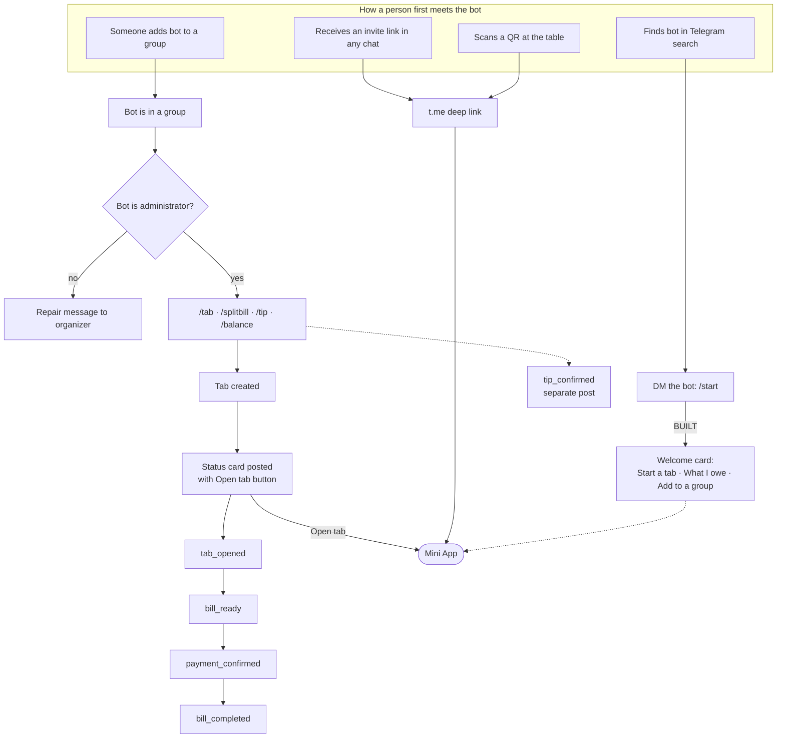
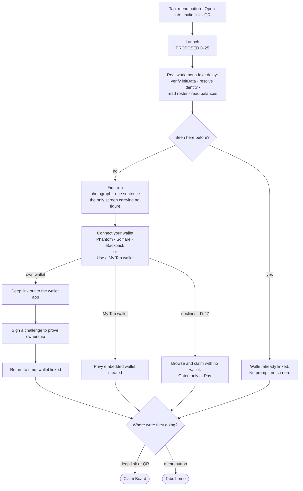
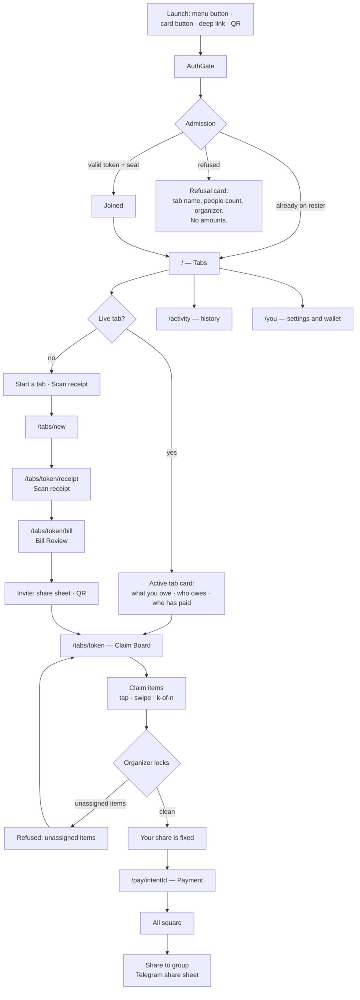
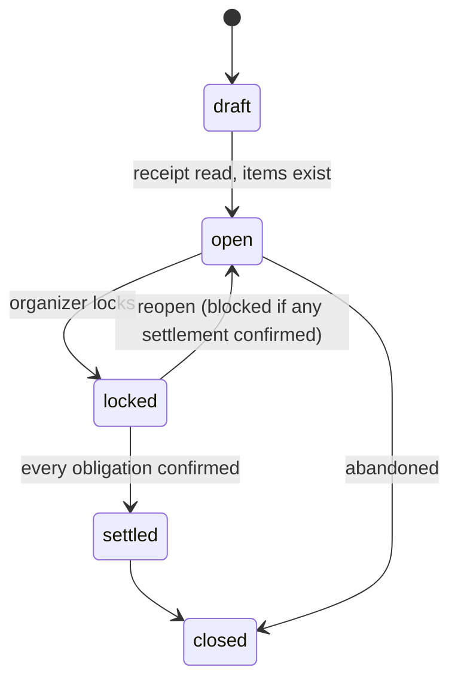
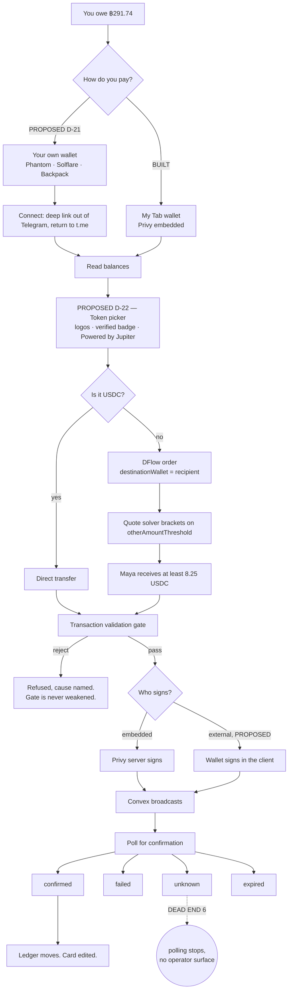

# My Tab — Flow Maps

**Status: planning artifact, 2026-08-22.** Every node below is marked with what is actually
in the tree. Nothing here is aspirational unless it says so.

This document exists to answer one question: *does every path have an answer, or does
something dead-end?* It maps three surfaces — the Telegram chat, launch, and the Mini App — plus
the settlement path, and ends with an audit of every dead end found, with file and line evidence.

`docs/DECISIONS.md` is still binding. D-21 through D-32 were written into it on
2026-08-22; they are no longer PROPOSED. Where this document still marks a *node* as
PROPOSED, that means the code is not in the tree — the decision is.

---

## Legend

| Mark | Meaning |
| :-- | :-- |
| **BUILT** | In the tree and reachable. |
| **PARTIAL** | Some of it exists; the marked gap is real. |
| **NOT BUILT** | Designed in an artifact, no code. |
| **DEAD END** | A user can reach this and has no next action. |
| **PROPOSED** | New, from the 2026-08-22 planning session. Needs a `DECISIONS.md` entry. |

---

## Decisions taken 2026-08-22, now recorded in `docs/DECISIONS.md`

| Ref | Decision | Supersedes |
| :-- | :-- | :-- |
| D-21 | **External wallets are the primary door.** Connect Phantom / Solflare / Backpack first; a Privy embedded wallet is created only for a payer who has none. | FR-A1, FR-W1; `lib/privy/config.ts:32` |
| D-22 | **DFlow gets a screen.** Token picker with balances, live quote, price protection stated plainly. | D-03's "the mechanism does not get a screen" |
| D-23 | **Quantity-aware claiming.** An item with quantity *n* can be claimed *k*-of-*n*; equal split among claimers remains the default. | Principle 4 is extended, not replaced |
| D-24 | **QR is a third admission door**, through the same seat check as the link. | New; `INVITE-FLOW.md` §1.5 must absorb it |
| D-25 | **Launch is an explicit connect gate.** The app loads, a first-timer sees the first-run screen, then chooses: connect your own wallet, or use a My Tab wallet. A returning person passes straight through. | Principle 6 — "no login screen, no 'connect wallet', no wallet selection inside Telegram" |
| D-26 | **The audience is crypto-native.** People arriving here know what a wallet is. Privy is the fallback for someone who has none, not the default for someone who has never held one. | The Andre persona in `PRODUCT.md` §Users |
| D-27 | **A wallet is not required to participate.** Browse the bill, claim your items, be part of the tab with no wallet at all. The gate is at payment, not at the board. | D-25's gate is a prompt, not a wall |
| D-28 | **Wallet support: wallet-standard first, three named.** Phantom, Solflare and Backpack are first-class; anything else that speaks the standard is admitted. | New |
| D-29 | **k-of-n is integer only.** Counts either sum to *n* or the board shows the shortfall. No fractional shares, ever — that is what keeps the remainder surface at zero. | Refines D-23 |
| D-30 | **`unknown` intents get both halves:** a payer-facing held state and an operator resolution surface. | `DECISIONS.md` U-5, `MAINNET-CUTOVER.md` §7 |
| D-31 | **Generated imagery is a photo header on the tab status card**, plus the bot avatar and the two Mini App screens D-13 already permits. Buttons get none, because Telegram buttons cannot carry images. | New |
| D-32 | **Receipt extraction goes through Vercel AI Gateway.** Convex Node action, Responses API, `AI_GATEWAY_API_KEY` Convex-only. First-candidate model `google/gemini-2.0-flash`. Do not vendor PaddleOCR/Donut. | AD-18, OQ-3 (`OPENAI_API_KEY` / direct OpenAI) |
| — | **U-1 resolved.** Token logos ship. `Powered by Jupiter` ships as a footer on the picker, an approved exception to the banned-copy list for a contractual string. | `DESIGN.md` §Components (`token-chip`: "No token logos"); `DECISIONS.md` U-1 |
| — | **U-9 resolved.** Revoke a leaked link from the invite sheet (next to Share + QR) **and** from a live-links list under You. Organizer-on-roster only. | `DECISIONS.md` U-9 |

---

## Map A — The Telegram chat

### The five posting events — **BUILT**

`lib/telegram/messages.ts:20-35`. Four of them render as **one status card that is edited in
place**, so a group chat never accumulates five My Tab messages for one dinner. `tip_confirmed`
is the only separate post.

| Event | Card says | Trigger |
| :-- | :-- | :-- |
| `tab_opened` | Tab name, organizer, people count, **Open tab** button | `/tab` in a group |
| `bill_ready` | Same card, edited: total, people, "ready to settle" | Organizer locks the bill |
| `payment_confirmed` | Same card, edited: n of m settled | Each confirmed settlement |
| `bill_completed` | Same card, edited: all square | Last obligation confirmed |
| `tip_confirmed` | New post: who tipped whom | A tip confirms |

Nothing else ever posts. "Share to group" is Telegram's own share sheet, sent by the person
(D-10) — not a sixth event.

### Bot commands — **BUILT** (Phase 0)

`BOT_COMMANDS = ["tab", "splitbill", "tip", "balance"]` at `convex/lib/tabCommandSync.ts:333`.
Scoped menus live in `lib/telegram/botSurface.ts`. `scripts/setup-telegram.mjs` calls
`setMyCommands` (private + group scopes) and `setChatMenuButton` at deploy.
`/splitbill` is routed but not listed. Private `/start` is answered.

### Chat refusals — **BUILT**

`lib/telegram/messages.ts:199-215`. Each names a cause and a next action.

| Refusal | Renderer |
| :-- | :-- |
| Bot is not an administrator | `renderBotAdminRepairMessage()` |
| You are not in this chat | `renderNotAMemberMessage()` |
| Too many requests | `renderRateLimitedMessage()` |

---

## Map B — Launch and first run

**The load is honest.** Launch genuinely verifies `initData`, resolves the Privy identity,
reads the roster and reads balances. The sequence covers real work — it is not a delay
inserted to feel substantial, and it must never become one.

**D-13 still holds and fits.** A photograph is permitted on exactly two screens — Launch and
first run — because they are the only two carrying no amount. The connect screen carries no
figure either, so it is inside the rule.

### Two schema facts that block D-21 today

1. **`wallets.privyWalletId` is required** (`convex/schema.ts:28`). An external wallet has no
   Privy wallet id. The field has to become optional, or the row needs a discriminated shape —
   `{ kind: "embedded", privyWalletId }` versus `{ kind: "external", provider }`. `isEmbedded`
   already exists at line 30, so the table was built expecting this.

2. **Linking a wallet must prove ownership, and cannot take an address as an argument.**
   `convex/wallets.ts:20` `syncEmbeddedWallet` is safe because Privy vouches for the address
   server-side. An external wallet has no such voucher — so linking requires a signed
   challenge, verified in Convex. Accepting a client-supplied address here would be the exact
   pattern that shipped hole H7 (D-16): *"Two request arguments agreeing with each other is not
   an authorization check."* An unproven link would let anyone name someone else's address as
   their own.

---

## Map C — The Mini App

### Routes — all **BUILT**

| Route | Surface | State |
| :-- | :-- | :-- |
| `/` | Tabs home | BUILT — content model changing, see below |
| `/tabs/new` | Start a tab | BUILT |
| `/tabs/[publicToken]` | Claim Board | BUILT |
| `/tabs/[publicToken]/bill` | Bill Review | BUILT |
| `/tabs/[publicToken]/receipt` | Scan receipt | BUILT |
| `/pay/[intentId]` | Payment | BUILT — gets the DFlow surface, D-22 |
| `/activity` | History | BUILT — needs the design pass |
| `/you` | Wallet and settings | BUILT — needs the design pass and D-21 |
| `/groups/[groupId]` | Group | BUILT |
| `/tips/new` | Tip | BUILT |

Bottom navigation is three roots — **Tabs · Activity · You** (`components/layout/AppShell.tsx:65-74`).

### Admission refusals — **BUILT**, and they are good

`convex/lib/sessionTokenOps.ts:178-204`. **The roster is checked above the token** (line 371):
an existing participant is admitted even on an expired or revoked link; a stranger is not
admitted on a live one. Every refusal returns tab name, people count and organizer name and
nothing else — a stranger cannot learn an amount or a roster.

| Code | What the person is told |
| :-- | :-- |
| `LINK_NOT_FOUND` | This link doesn't work — ask for a new one |
| `LINK_EXPIRED` | This link has expired — ask for a new one |
| `LINK_REVOKED` | Same words, deliberately distinct internal code |
| `TAB_CLOSED` | This tab has closed |
| `TAB_LOCKED_NO_ENTRY` | The bill is locked — ask the organizer to reopen |
| `TAB_FULL` | The tab is full — ask for a seat |
| `NOT_GROUP_MEMBER` | Live `getChatMember` says you are not in the chat |
| `BOT_NOT_ADMIN` | **Should not exist after D-06's invite door lands** |

### Tab lifecycle — **BUILT**

`convex/schema.ts:348-354`.

Reopen is refused with `CONFIRMED_SETTLEMENT_EXISTS` or `IN_FLIGHT_INTENT`
(`convex/lib/…:217-244`). Lock is refused with `UNASSIGNED_ITEMS`,
`RECIPIENT_WALLET_REQUIRED`, `PAYER_IS_RECIPIENT`, `INVARIANT_FAILED`.

---

## Map D — Settlement, with D-21 and D-22 applied

Intent states are `submitted · unknown · confirmed · failed · expired`
(`convex/schema.ts:158-162`). **Confirmation moves the ledger, not submission** (AD-11).

Two things D-21 changes that are easy to miss:

1. **Sponsored fees survive.** The sponsor is `account[0]` and pays the fee regardless
   (D-04). An external wallet signs as a second signer. Nobody sees a network fee either way.
2. **A second signing path enters the validation gate.** The gate must apply identically to
   a client-signed transaction. Per CLAUDE.md, the gate is never weakened to let a route
   pass — so the external path is constrained to what the gate already accepts.

---

## The dead-end audit

Twelve. Six are live defects, six are things a chosen design does not have yet.

### Live defects — a real user can hit these today

| # | Dead end | Evidence | Consequence |
| :-- | :-- | :-- | :-- |
| 1 | **DM `/start` is answered with silence.** | Closed Phase 0 — private messages normalize; welcome card replies. | — |
| 2 | **Commands are never registered with Telegram.** | Closed Phase 0 — `setMyCommands` / `setChatMenuButton` in setup + `registerBotSurface`. | — |
| 3 | **The invite door does not exist.** `origin` appears 0 times in `convex/`, `lib/`, `features/`. | grep | A tab cannot exist without a group chat with an admin bot — the exact four-step onboarding D-06 deleted. |
| 4 | **`publishTabOpenedCard` ignores `chatId`, `tabName` and `opaqueToken`.** | Closed Phase 0 — `opaqueToken` is stored as `deepLinkToken` and reused on every edit. `chatId` / `tabName` still come from the stored tab row (authorization from a record, not an argument). | — |
| 5 | **`revokeToken` and `consumeToken` have no callers.** | `convex/sessionTokens.ts:268,287` | `LINK_REVOKED` is a refusal nothing can produce. An organizer cannot kill a leaked link. |
| 6 | **`unknown` intents strand.** Finalized but failed a confirmation check → polling stops, no operator surface. | `DECISIONS.md` U-5 | A payer's money moved and the app cannot say so. Flagged in `MAINNET-CUTOVER.md` as "the one gap I would close before real money." |

### Gaps in the chosen design — nothing exists yet

| # | Gap | Blocks |
| :-- | :-- | :-- |
| 7 | External wallet connect (D-21) | The entire connect-first premise |
| 8 | Token picker with balances (D-22) | The DFlow demo |
| 9 | Quantity-aware claiming, *k*-of-*n* (D-23) | "We ordered three beers, I had two" |
| 10 | QR admission (D-24) | The person sitting across the table |
| 11 | Partial payment is not representable | `DECISIONS.md` U-5 |
| 12 | Swipe-to-claim, sheet physics, haptics | The premium feel |

### Closed since `DECISIONS.md` was written

`TabDeepLinkSurface` no longer has a fixture branch — `features/tabs/TabDeepLinkSurface.tsx:242`
handles `status === "error"` and nothing else. `INVITE-FLOW.md` §9.11 **B5 is done** and U-6
should be amended.

---

## What Map C's home screen becomes

From the 2026-08-22 session: home changes shape with state, and every element has a container.

**No live tab** — two actions and nothing else. Start a tab. Scan receipt. A person who
skipped the chat entirely can begin here; that is the point of the invite door.

**A live tab you organize** — one card, and it is the screen:

- The amount, first. Tabular, unrounded, never truncated.
- Who created it.
- Who owes and who has paid — avatar chips with settled state carried by a glyph, never
  by colour alone.
- Your one action, pinned above the safe area.

**A live tab you joined** — the same card, your share as the hero, your action pinned.

History and settings sit under the nav, not on the home screen. Balance-first is not the home
screen; that is the wallet-app anti-reference `PRODUCT.md` names.

---

---

## Where generated imagery can actually go

Checked against the Bot API and the tree, because the obvious answer does not work.

**Buttons cannot carry images.** `lib/telegram/api.ts:217` types the inline keyboard as
`{ text: string; url: string }` — text and emoji, nothing else. That is the Bot API's shape,
not a repo limitation. The Menu button takes no custom icon either. **No amount of image
generation puts a picture on a Telegram button.**

Three places imagery can live:

| Place | How | Cost |
| :-- | :-- | :-- |
| **Photo header on the tab status card** | `sendPhoto` with a caption instead of `sendMessage` | The edit-in-place flow changes from `editMessageText` to `editMessageCaption` (`convex/internal/telegramDelivery.ts:184,192`), and the caption cap drops from 4096 to 1024 characters |
| **The bot's avatar** | Set once on the bot profile | None |
| **Launch and first run in the Mini App** | Already permitted by D-13 | None — these are the only two screens carrying no figure |

**One image per tab, set at `tab_opened`.** The card is edited in place through `bill_ready`,
`payment_confirmed` and `bill_completed`, so the photo is chosen once and the caption changes
underneath it. Re-generating per state would mean deleting and re-posting, which breaks the
one-card-per-dinner property that keeps a group chat clean.

**The photo is a header, not a figure surface.** D-13's rule — no photograph on any surface
carrying an amount — is a Mini App rule. A chat card is outside it. But the same reasoning
applies: keep the image atmospheric, never let it sit behind a number.

---

## Build plan

Sequenced by dependency, not by appetite. Every phase ends with the five gates green:
`npx tsc --noEmit` · `npm test` · `npx next build` · `npm run smoke` · `npm run sweep`.

### Phase 0 — Open the front door · **BUILT**

`setMyCommands` + `setChatMenuButton` at deploy (`scripts/setup-telegram.mjs`,
`lib/telegram/botSurface.ts`). Private `/start` is answered (`lib/telegram/privateMessages.ts`).
`publishTabOpenedCard` reuses `deepLinkToken` on the status card.

### Phase 1 — The invite door and QR · ~3 days · D-06, D-24, U-9

Unblocks every tab that has no group chat. The roster and seat halves already exist; the door
does not.

1. Add `origin: "chat" | "personal"` — currently 0 occurrences repo-wide.
2. Drop `BOT_NOT_ADMIN` as a hard refusal on the invite path
   (`convex/lib/sessionTokenOps.ts:425,599`). Chat-origin still requires it.
3. Insert the organizer into `tabParticipants` at creation, both doors
   (`INVITE-FLOW.md` §9.11 B7).
4. QR through the same seat check as the link. Same token, different carrier — no second
   admission path.
5. Wire `revokeToken` (`convex/sessionTokens.ts:268`) as organizer-on-roster. Surfaces: invite
   sheet (next to Share + QR) **and** a live-links list under You (U-9). `consumeToken` stays
   for single-use action tokens.

### Phase 1b — Live receipt extraction · ~2 days · AD-18, D-32 · parallel with Phase 1

Convex Node action → Vercel AI Gateway (`https://ai-gateway.vercel.sh/v1`) → strict JSON →
`lib/domain/receiptParse.ts`. Secret: `AI_GATEWAY_API_KEY` in Convex env. First-candidate
model: `google/gemini-2.0-flash`. Missing key fails closed (D-11). Copy: **Scan receipt**.
Do not vendor PaddleOCR, Donut, doctr, or Mindee.

### Phase 2 — Wallets · ~4 days · D-21, D-25, D-27, D-28

1. `wallets.privyWalletId` optional or discriminated (`convex/schema.ts:28`).
2. **`linkExternalWallet` with a signed challenge verified in Convex.** Never an address
   argument — see D-16 hole H7.
3. Connect sheet: wallet-standard detection, Phantom / Solflare / Backpack named.
4. Launch sequence and first run (D-25); the no-wallet path stays open to the board (D-27).
5. Client-side signing through the **unchanged** validation gate.

### Phase 3 — The DFlow surface · ~4 days · D-22

The hackathon centerpiece. Depends on Phase 2 — a token picker needs a wallet to read.

1. Balances per linked wallet.
2. Token picker: logos, `isVerified === true` badge, `Powered by Jupiter` footer.
3. Live quote on `otherAmountThreshold` (D-08) — never `outAmount`, which is an estimate.
4. "Maya receives at least 8.25 USDC" as the one guaranteed figure.
5. Post-payment detail showing what actually routed.

Banned copy still applies at full force: **price protection**, never *swap* / *route* /
*slippage*.

### Phase 4 — Claiming · ~2 days · D-23, D-29

Integer *k*-of-*n* stepper. Allocation math stays in `lib/domain/` as pure functions with unit
tests, no Convex import, no I/O. Counts sum to *n* or the board shows the shortfall — that is
what keeps the remainder surface at zero.

### Phase 5 — The premium pass · ~5 days

Craft first, motion second — the craft half ships something visibly better on its own.

1. Type scale, spacing rhythm, button pressure states, hairlines, shadow discipline.
2. The bottom bar reads as native, not web.
3. Home, Activity and You get real containers — nothing floating in open space.
4. Then: swipe-to-claim, sheet physics, haptics. Watch for collisions with Telegram's own
   swipe-to-close.

`npm run sweep` after every change in this phase. It is the only gate that catches an inert
sticky element or a truncated amount, and it is not in CI.

### Phase 5b — Card imagery · D-31 · U-8 resolved 2026-08-23

One house-style 35mm still, repeated — not derived from tab name or merchant.
Asset at `public/tab-card/house.webp` (Kie `nano-banana-2`, 4:3 at 2K). First
`tab_opened` `sendPhoto` uploads it; Telegram `file_id` is stored on
`telegramStatusMessages.photoFileId` and reused. Later states `editMessageCaption`
only. Runtime Convex does not call Kie. Missing `KIE_API_KEY` at generate-time
is a hard fail, never a fixture photo (D-11).

### Phase 6 — Before mainnet, not before the demo · D-30 · implemented 2026-08-23

`unknown` intents get a payer-facing held state (`held`, not `submitted`) and an operator
resolution surface (`reconciliationIncidents`, internal query, Convex HTTP list gated by
`OPERATOR_RECONCILIATION_SECRET`). This is the only dead end on the audit that touches real
money. It does not block a demo; it blocks a cutover until the operator secret is set.

---

## Still open

1. **Wallet-standard on iOS (U-10).** Mobile Wallet Adapter is Android-oriented; on iOS the
   practical path is per-wallet universal links. If that holds, the three named wallets are
   load-bearing on iOS rather than a convenience layer over a generic standard. **Verify
   before Phase 2 estimates are trusted.**
